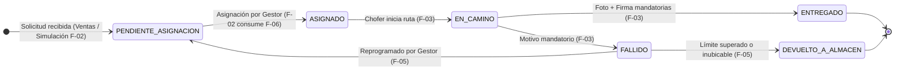

# Despacho Context & Development Runbook

Este skill proporciona el contexto completo de negocio, arquitectura, directrices de desarrollo y reglas de gobernanza del **Módulo de Despacho y Logística de Última Milla**. Actúa como guía para asegurar la coherencia técnica y funcional en todos los componentes del sistema.

---

## 1. Visión del Sistema y Límites de Dominio

- **Tipo de Arquitectura:** Microservicio autónomo con base de datos propia e independiente (PostgreSQL en Supabase).
- **Aislamiento:** No se accede directamente a bases de datos de otros módulos (Ventas, Inventario, Postventa o Seguridad).
- **Ecosistema Comercial:** Se comunica con el módulo de Ventas (para recibir pedidos y notificar entregas) y con Devoluciones (para paquetes devueltos a almacén) mediante APIs REST y Webhooks asíncronos.

---

## 2. Mapa Oficial de Integrantes y Funcionalidades

| ID | Funcionalidad | Integrante Responsable | Enfoque Operativo |
| :--- | :--- | :--- | :--- |
| **F-01** | Gestor de Zonas Geográficas y Cotizador | **VALQUI** (Integrante 1) | Matriz de tarifas y endpoint `POST /api/v1/zonas/cotizar` para carritos de venta. |
| **F-02** | Panel de Programación y Asignación | **NICOLÁS** (Integrante 2) | Cola de pendientes, pedidos simulados para testing autónomo y asignación de despachos. |
| **F-03** | App Móvil del Repartidor y Evidencia | **MAX ROJAS** (Integrante 3) | PWA móvil para ruta, fotos del paquete, firmas táctiles y motivos de fallo. |
| **F-04** | Portal Web de Tracking (Cliente) | **Integrante 4** | Consulta pública de solo lectura por código de rastreo, timeline y mapa referencial. |
| **F-05** | Centro de Entregas Fallidas | **GERARDO** (Integrante 5) | Resolución de incidencias, validación de reintentos máximos, reprogramación o devolución a almacén. |
| **F-06** | Monitoreo de Flota y Capacidad | **RHAMSES** (Integrante 6) | CRUD de choferes y vehículos, control de turnos y endpoint `GET /api/v1/repartidores/disponibles`. |

---

## 3. Máquina de Estados del Despacho

Cualquier desarrollo en backend o frontend debe respetar rigurosamente la secuencia de transiciones:

### Reglas de Transición Inviolables
1. **Progresión hacia adelante:** El repartidor en calle solo transiciona `ASIGNADO` $\rightarrow$ `EN_CAMINO` $\rightarrow$ `ENTREGADO` o `FALLIDO`.
2. **Evidencia mandatoria para `ENTREGADO`:** Fotografía del paquete (comprimida en cliente a < 500 KB) + firma digitalizada + datos del receptor (nombre y DNI).
3. **Motivo mandatorio para `FALLIDO`:** Selección tipificada del catálogo (`CLIENTE_AUSENTE`, `DIRECCION_NO_UBICADA`, `PAQUETE_RECHAZADO`, `ZONA_INACCESIBLE`).

---

## 4. Reglas de Gobernanza del Repositorio ([AGENTS.md](../../AGENTS.md))

### 4.1 Convención de Código (Java)
- **Idioma:** 100% en español para nombres de clases, métodos, variables, DTOs y mensajes de log.
- **Clases y Enums:** `PascalCase` (ej. `GestorZonasGeograficas`, `EstadoDespacho`).
- **Valores de Enums:** `UPPER_SNAKE_CASE` (ej. `PENDIENTE_ASIGNACION`, `ASIGNADO`, `EN_CAMINO`, `ENTREGADO`, `FALLIDO`, `DEVUELTO_A_ALMACEN`).
- **Métodos y Variables:** `camelCase` (ej. `idDespacho`, `obtenerDespachoPorId`).
- **Constantes:** `UPPER_SNAKE_CASE` (ej. `MAXIMO_REINTENTOS`).

### 4.2 Formato y Estructura Markdown
- Cada archivo comienza con un **único H1** (`# Título`).
- Sin saltos de jerarquía (`##` antes de `###`).
- Escenarios en formato Gherkin estricto (`DADO` / `CUANDO` / `ENTONCES`).

### 4.3 Unicidad de Contratos y Actualización de Índices
- **Contrato Único:** Todo endpoint de comunicación frontend-backend debe registrarse **únicamente** en `specs/api-contract.md`. Prohibido crear contratos paralelos.
- **Índice Funcional:** Toda modificación, alta o cambio de estado de una especificación debe actualizar la tabla de `specs/funcionalidad.md`.
- **Índice Principal:** Toda sección relevante debe reflejarse en `README.md`.

### 4.4 Flujo de Trabajo Git y Commits ([CONTRIBUTING.md](../../CONTRIBUTING.md))
- **Nomenclatura de Ramas:** `feature/f<XX>-<descripcion-corta>` (ej. `feature/f02-programacion-asignacion`).
- **Conventional Commits en español:** `<tipo>(<alcance>): <descripción>` (`feat`, `fix`, `docs`, `test`, `refactor`, `chore`).
- **Pull Requests:** Prohibido hacer push directo a `main`. Todo cambio entra por PR validado con al menos 1 revisión aprobada.

---

## 5. Stack Tecnológico Aprobado

- **Backend:** Java 21 (LTS), Spring Boot 3.3.x, Maven, Spring Data JPA / Hibernate 6, Spring Security con tokens JWT Bearer, Lombok, JUnit 5 + Mockito.
- **Frontend:** React 18/19, Vite, Tailwind CSS, `react-router-dom`, `axios`, `@tanstack/react-query`, `vite-plugin-pwa`, `react-signature-canvas`, `browser-image-compression`, `leaflet` + `react-leaflet`, `lucide-react`.
- **Base de Datos:** PostgreSQL v15/v16 en Supabase con conexión Supavisor (puerto 6543) y extensión `PostGIS`.
- **Eventos:** `IEventoPublisher` vía Webhooks HTTP asíncronos (`@Async` con reintentos hacia Ventas y Devoluciones).

---

## 6. Checklist de Verificación para el Desarrollador y el Agente

Antes de dar por completado un cambio o entrega:
- [ ] ¿El cambio respeta la máquina de estados y las validaciones de capacidad/disponibilidad?
- [ ] ¿El código Java y las entidades siguen los estándares de nomenclatura y el idioma español?
- [ ] ¿Los endpoints nuevos o modificados están actualizados en [specs/api-contract.md](../../specs/api-contract.md)?
- [ ] ¿Se actualizó la tabla de control en [specs/funcionalidad.md](../../specs/funcionalidad.md)?
- [ ] ¿El commit y la rama siguen las convenciones de [CONTRIBUTING.md](../../CONTRIBUTING.md)?
- [ ] ¿Se añadieron o actualizaron pruebas unitarias con JUnit 5 y Mockito para los escenarios Gherkin definidos?
