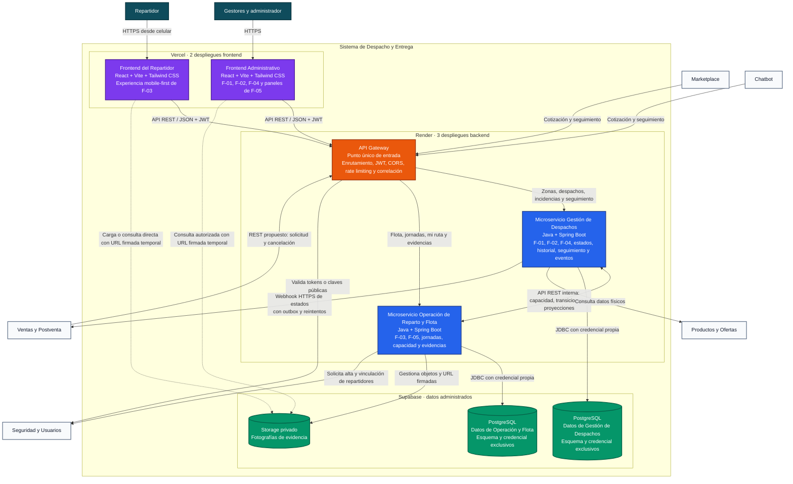

# Arquitectura C4: Diagrama de Contenedores

> **Estado:** Propuesta para discusión del equipo. Ningún contenedor, protocolo o proveedor descrito aquí se considera aprobado hasta que el equipo lo acuerde.

Este documento presenta el nivel 2 del modelo C4. Muestra una arquitectura con dos aplicaciones frontend, dos microservicios, un API Gateway, persistencia administrada y notificación asíncrona mediante webhook HTTPS con outbox.

## 1. Diagrama de contenedores



## 2. Catálogo de contenedores

| Contenedor | Responsabilidad | Tecnología prevista | Despliegue | Dependencias directas |
|---|---|---|---|---|
| Frontend Administrativo | Experiencia para `GESTOR_DESPACHO`: zonas, tarifas, programación, incidencias, flota y jornadas | React, Vite y Tailwind CSS | Proyecto independiente en Vercel | API Gateway y, mediante URL firmada, Storage |
| Frontend del Repartidor | Ruta diaria, detalle, transiciones en campo, evidencia y cierre de jornada | React, Vite y Tailwind CSS, diseño mobile-first | Proyecto independiente en Vercel | API Gateway y, mediante URL firmada, Storage |
| API Gateway | Única URL pública; enruta por capacidad, aplica CORS, límite de cotizaciones, validación inicial del JWT e identificador de correlación | Java y componente Gateway compatible con el stack Spring | Servicio independiente en Render | Seguridad y Usuarios, ambos microservicios |
| Microservicio Gestión de Despachos | Fuente única de zonas, tarifas y del estado del despacho; asignación, reprogramación, seguimiento, historial y publicación de eventos | Java 21, Spring Boot, Maven, Spring Web, Spring Security y JPA | Servicio independiente en Render | Su PostgreSQL, Operación de Reparto, Productos y Ofertas, Ventas y Postventa |
| Microservicio Operación de Reparto y Flota | Fuente única de repartidores, furgonetas, jornadas y capacidad; operación móvil y gestión de evidencias | Java 21, Spring Boot, Maven, Spring Web, Spring Security y JPA | Servicio independiente en Render | Su PostgreSQL, Storage, Gestión de Despachos y Seguridad y Usuarios |
| Datos de Gestión de Despachos | Zonas, tarifas, despachos, historial, intentos, recepciones, idempotencia y bandeja de eventos salientes | PostgreSQL administrado por Supabase | Un esquema o base lógica aislada | Solo Gestión de Despachos |
| Datos de Operación y Flota | Repartidores, furgonetas, jornadas, reservas de capacidad, proyección de ruta y referencias de evidencia | PostgreSQL administrado por Supabase | Un esquema o base lógica aislada | Solo Operación de Reparto y Flota |
| Storage de evidencias | Binarios de fotografías en un bucket privado; acceso temporal mediante URL firmada | Supabase Storage | Bucket privado | Operación de Reparto y clientes autorizados mediante URL temporal |

## 3. Responsabilidad de cada microservicio

### 3.1. Gestión de Despachos

Este microservicio responde **qué debe ocurrir con el paquete**. Es el único dueño del estado canónico del despacho y de su máquina de estados.

- F-01: zonas, tarifas, cobertura y cotización.
- F-02: recepción, cola, asignación, reasignación, secuencia y cancelación.
- F-04: recepción en el centro, reprogramación y cierre como `DEVUELTO_A_ORIGEN`.
- Requisitos transversales: máquina de estados, historial, seguimiento y eventos a Ventas y Postventa.

### 3.2. Operación de Reparto y Flota

Este microservicio responde **quién ejecuta la entrega, con qué recursos y qué ocurrió en campo**.

- F-03: ruta del repartidor, habilitación, inicio del traslado, entrega, fallo, cierre de jornada y evidencia.
- F-05: repartidores, furgonetas, asignaciones diarias, disponibilidad y capacidad.

Cuando F-03 origina una transición, Operación de Reparto valida al repartidor, su jornada y la evidencia, y solicita el cambio a Gestión de Despachos. Solo Gestión de Despachos modifica el estado canónico, el contador de intentos y el historial.

## 4. Comunicaciones

La arquitectura utiliza REST para preguntas y comandos que necesitan una respuesta inmediata, y webhook HTTPS con outbox para comunicar a Ventas y Postventa hechos ya confirmados.

| Interacción | Mecanismo | Motivo |
|---|---|---|
| Cotización y seguimiento | API REST síncrona mediante el Gateway | El canal necesita mostrar una respuesta inmediata al usuario. |
| Ventas solicita un despacho | API REST síncrona e idempotente | Permite validar cobertura y devolver de inmediato el identificador y código de rastreo. |
| Ventas solicita una cancelación | API REST síncrona e idempotente | Ventas necesita conocer si el estado actual todavía permite cancelar. |
| Despacho informa cambios de estado | Webhook HTTPS con outbox, identificador idempotente y reintentos | La notificación no bloquea ni revierte una transición local confirmada. |
| Gestión consulta, reserva o libera capacidad | API REST interna síncrona e idempotente | La asignación necesita confirmar en ese momento si existe capacidad. |
| Reparto solicita una transición de campo | API REST interna síncrona e idempotente | El repartidor necesita conocer el resultado de la operación. |
| Gestión comunica un estado confirmado a Reparto | API REST interna idempotente y versionada | Mantiene la proyección sin compartir la base de datos. |
| Seguridad entrega identidad y roles | JWT validado localmente mediante JWKS | Evita consultar Seguridad en cada petición. |
| Alta o vinculación de un repartidor | API REST con resultado o estado pendiente | La ruta y el scope definitivos deben acordarse con Seguridad. |
| Carga de evidencia | URL firmada hacia Storage | La transferencia directa evita que el Gateway transporte archivos grandes. |

### 4.1. Webhook y bandeja de salida

El webhook no es un contenedor adicional: es una relación HTTPS saliente hacia Ventas y Postventa. Gestión de Despachos registra primero cada evento en su bandeja de salida dentro de la misma transacción del cambio de estado. Un proceso posterior realiza el envío y los reintentos conservando el mismo identificador idempotente.

## 5. Propiedad y aislamiento de datos propuestos

- Cada microservicio utiliza una credencial de base de datos diferente.
- Un microservicio no consulta tablas ni esquemas del otro y no existen claves foráneas cruzadas.
- Para el curso se puede utilizar un único proyecto de Supabase con dos esquemas aislados. Dos proyectos independientes ofrecen mayor aislamiento, pero también mayor costo operativo.
- Gestión de Despachos conserva identificadores externos de repartidor, jornada y reserva, no relaciones JPA hacia tablas de Operación de Reparto.
- Operación de Reparto puede mantener una proyección mínima de la ruta para lectura móvil, pero Gestión de Despachos conserva la verdad oficial del despacho.
- Supabase Auth no se utiliza: la autenticación y los roles pertenecen al módulo Seguridad y Usuarios.
- El Gateway valida la firma y vigencia del token como primera barrera; cada microservicio vuelve a validar el rol, la operación permitida y la propiedad del recurso.
- Las llamadas internas entre microservicios utilizan credenciales de servicio y no quedan expuestas como rutas públicas del Gateway.

## 6. Flujo candidato de evidencia fotográfica

1. El Frontend del Repartidor solicita al Gateway autorización para cargar una evidencia.
2. Operación de Reparto valida el JWT, el propietario del despacho, la jornada y el tipo esperado.
3. Operación de Reparto genera una autorización temporal de carga para el bucket privado.
4. El navegador carga el archivo directamente en Supabase Storage.
5. El frontend confirma la operación enviando la referencia de evidencia, no la fotografía en Base64.
6. Operación de Reparto valida la referencia y solicita a Gestión de Despachos la transición correspondiente.
7. Para visualizarla, un usuario autorizado recibe una URL firmada de corta vigencia.

Si la transición es rechazada, el objeto cargado queda temporalmente sin asociación y puede eliminarse mediante una tarea periódica. Esta propuesta supone Supabase Storage; el mecanismo continúa sujeto a la decisión pendiente de F-03.

## 7. Organización de repositorios y despliegues

La cantidad de repositorios no tiene que coincidir con la cantidad de aplicaciones o microservicios. La propuesta conserva tres repositorios y utiliza los repositorios de implementación como monorepos.

```text
G2-Despacho-Specs/
└── documentación funcional, C4, contratos y decisiones

frontend/
├── apps/
│   ├── despacho-administrativo/
│   └── despacho-repartidor/
└── packages/
    ├── componentes-compartidos/
    ├── cliente-api/
    └── tipos-compartidos/

backend/
├── api-gateway/
├── servicio-gestion-despachos/
├── servicio-operacion-reparto/
└── pom.xml
```

| Repositorio | Aplicaciones | Despliegues previstos |
|---|---|---|
| `G2-Despacho-Specs` | Documentación | Sin despliegue de ejecución |
| `frontend` | Frontend Administrativo y Frontend del Repartidor | Dos proyectos en Vercel |
| `backend` | API Gateway y dos microservicios | Tres servicios en Render |

Cada aplicación debe tener su propio archivo de configuración, variables de entorno, pruebas y comando de construcción. Los paquetes compartidos del frontend contienen componentes visuales y tipos, pero no reglas de negocio. En backend se pueden compartir convenciones técnicas mínimas; no se comparte el modelo JPA ni el acceso a datos.

### 7.1. Configuración mínima por despliegue

| Despliegue | Directorio raíz sugerido | Configuración externa necesaria |
|---|---|---|
| Vercel: Administrativo | `apps/despacho-administrativo` | URL pública del API Gateway |
| Vercel: Repartidor | `apps/despacho-repartidor` | URL pública del API Gateway; la autorización temporal de Storage se recibe desde la API |
| Render: API Gateway | `api-gateway` | URL interna de ambos microservicios, origen CORS permitido y datos para validar tokens de Seguridad |
| Render: Gestión de Despachos | `servicio-gestion-despachos` | Conexión PostgreSQL propia, URL interna de Operación de Reparto, URL de Productos, URL del webhook de Ventas y credenciales de servicio |
| Render: Operación de Reparto y Flota | `servicio-operacion-reparto` | Conexión PostgreSQL propia, URL interna de Gestión de Despachos, URL de Seguridad y credenciales privadas de Storage |

Los secretos de base de datos, claves de servicio y credenciales privadas de Storage se configuran únicamente en Render. Nunca se incorporan al código fuente ni a las variables públicas de Vercel.

## 8. Decisiones que el equipo debe cerrar

| Decisión | Recomendación para discutir | Cuándo cambiarla |
|---|---|---|
| URL y seguridad del webhook | Webhook HTTPS con outbox e identificador idempotente | Completar la URL y el scope cuando Ventas confirme su contrato de recepción |
| Comunicación entre microservicios | APIs REST internas idempotentes, autenticadas y versionadas | Ajustar solamente si cambia el contrato interno |
| Redis | No incluirlo todavía | Incorporarlo si se requiere rate limiting global con varias instancias, caché compartida o coordinación distribuida medida |
| Base de datos | Un proyecto Supabase con dos esquemas y credenciales aisladas para el curso | Separar proyectos si se necesita aislamiento físico o despliegue realmente independiente |
| Evidencias | Evaluar Supabase Storage privado con URL firmada | Cambiar si F-03 define otro proveedor o procesamiento especializado |
| Autenticación | Consumir JWT de Seguridad; no usar Supabase Auth | Cambiar únicamente por acuerdo con Seguridad y Usuarios |
| Mapas, GPS y optimización | No mostrarlos como contenedores actuales | Incorporarlos cuando entren formalmente al alcance funcional |

Redis no se agrega solo por utilizar microservicios; se incorporará únicamente si aparece una necesidad medida de caché compartida, rate limiting distribuido o coordinación entre instancias.
