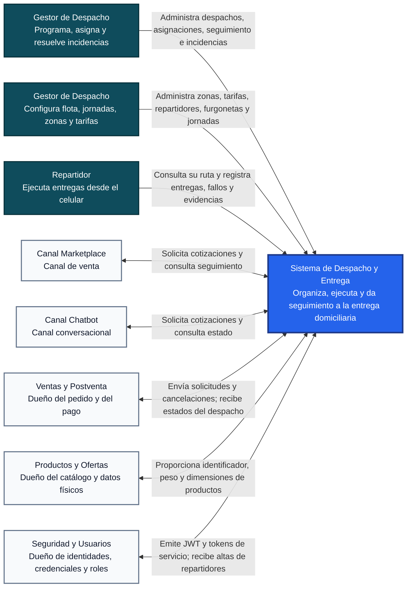

# Arquitectura C4: Diagrama de Contexto

> **Estado:** Propuesta para discusión del equipo. Este documento no modifica ni reemplaza las especificaciones funcionales vigentes.

Este documento presenta el nivel 1 del modelo C4 del Sistema de Despacho y Entrega a Domicilio. Su objetivo es mostrar, sin detalles técnicos de implementación, quiénes utilizan el sistema, con qué sistemas externos se integra y qué información intercambia con cada uno. Los mecanismos de comunicación se alinean con `integraciones/api-contract.md`.

## 1. Diagrama de contexto

## 2. Personas y responsabilidades

| Persona | Qué entrega al sistema | Qué recibe del sistema |
|---|---|---|
| Gestor de Despacho | Decisiones de asignación, reasignación, recepción, reprogramación y cierre | Cola de despachos, capacidad disponible, estado, historial y alertas de incidencias |
| Gestor de Despacho | Datos de zonas, tarifas, repartidores, furgonetas y jornadas | Ocupación de flota, disponibilidad, conflictos y auditoría de configuración |
| Repartidor | Inicio del traslado, resultado de la entrega, fotografía, motivo de fallo y cierre de jornada | Ruta ordenada, detalle del destinatario mientras corresponde, confirmaciones y resumen diario |

## 3. Sistemas externos e intercambios

| Sistema externo | Información recibida por Despacho | Información enviada por Despacho | Mecanismo | Funcionalidad relacionada |
|---|---|---|---|---|
| Canal Marketplace | Productos, cantidades y destino para cotizar; consulta de seguimiento autorizada | Cobertura, costo, plazo estimado y estado resumido del despacho | API REST síncrona, directamente o mediante Ventas y Postventa | F-01, seguimiento transversal |
| Canal Chatbot | Productos, cantidades y destino para cotizar; consulta de estado autorizada | Cobertura, costo, plazo estimado y estado resumido del despacho | API REST síncrona, directamente o mediante Ventas y Postventa | F-01, seguimiento transversal |
| Ventas y Postventa | Solicitud REST de despacho de un pedido pagado y preparado; solicitud de cancelación | Aceptación con identificador y código de rastreo; cambios de estado idempotentes mediante webhook | API REST síncrona de entrada y webhook HTTPS con outbox y reintentos de salida | F-02, F-04, eventos transversales |
| Productos y Ofertas | Identificador, peso y dimensiones vigentes de los productos cotizados o incluidos en el pedido | Solicitud en lote de datos físicos por SKU | API REST síncrona | F-01, F-02 |
| Seguridad y Usuarios | JWT, roles, identificador de usuario, tokens de servicio y claves públicas | Solicitud de creación o vinculación de usuarios con rol `REPARTIDOR` | Validación local de JWT mediante JWKS y API REST | Todas, especialmente F-03 y F-05 |

## 4. Límites del contexto

- El sistema es dueño de los despachos, las zonas y tarifas, la operación de reparto, la flota y las evidencias.
- Ventas y Postventa conserva la propiedad del pedido, el pago, las anulaciones comerciales, los reembolsos y los reclamos.
- Productos y Ofertas conserva la propiedad del catálogo, el stock y los datos físicos de los productos.
- Seguridad y Usuarios conserva la propiedad de las identidades, credenciales y roles.
- Marketplace y Chatbot son canales consumidores; no crean directamente la entidad despacho.
- No existe integración con Retail dentro del alcance vigente.
- No se incluyen mapas, navegación, GPS, notificaciones al cliente ni optimización automática de rutas porque no forman parte de F-01 a F-05.

## 5. Acuerdos externos pendientes

Antes de aprobar este contexto se debe confirmar con los otros equipos:

1. Si Marketplace y Chatbot consumirán cotización y seguimiento directamente o siempre a través de Ventas y Postventa.
2. La URL y el scope que Ventas y Postventa expondrá para recibir el webhook de cambios de estado.
3. La ruta, el scope y las unidades definitivas de la consulta en lote a Productos y Ofertas.
4. El emisor, la representación de scopes y la operación definitiva de alta o vinculación de repartidores en Seguridad y Usuarios.

## 6. Regla de lectura

Este diagrama responde únicamente a las preguntas **quién usa el sistema** y **con qué otros sistemas se comunica**. Vercel, Render, Supabase, las aplicaciones frontend, el API Gateway y los microservicios pertenecen al nivel de contenedores y se muestran en `c4-contenedores.md`.
