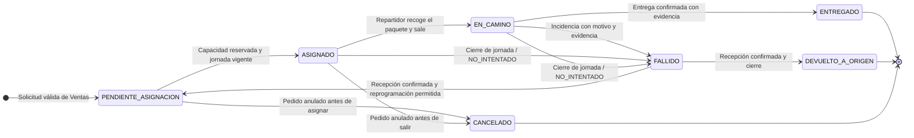

# Diagrama de Estados del Despacho

Este documento es la referencia arquitectónica del ciclo de vida del despacho. Resume la máquina de estados definida por las funcionalidades F-02, F-03 y F-04 y por los requisitos transversales RT-01 a RT-03 del `overview.md`.

## 1. Diagrama de estados

## 2. Significado de los estados

| Estado | Significado | Ubicación física esperada | Final |
|---|---|---|---|
| `PENDIENTE_ASIGNACION` | El despacho fue aceptado y espera repartidor. | Paquete sellado en el centro de despacho. | No |
| `ASIGNADO` | Tiene repartidor, jornada, reserva de capacidad y secuencia. | Permanece en el centro hasta que el repartidor confirme la salida. | No |
| `EN_CAMINO` | El repartidor recogió el paquete y comenzó el traslado. | En poder del repartidor, fuera del centro. | No |
| `ENTREGADO` | La entrega fue confirmada con evidencia fotográfica. | En poder del destinatario. | Sí |
| `FALLIDO` | No se entregó o terminó la jornada sin intentarlo. | En poder del repartidor hasta que regrese al centro. | No |
| `DEVUELTO_A_ORIGEN` | El paquete fallido fue recibido y el despacho se cerró sin otro intento. | En el centro, a disposición de Ventas y Postventa. | Sí |
| `CANCELADO` | Ventas anuló el pedido antes de comenzar el traslado. | En el centro de despacho. | Sí |

## 3. Condiciones de cada transición

| Origen | Destino | Ejecuta | Precondiciones principales | Efectos principales |
|---|---|---|---|---|
| — | `PENDIENTE_ASIGNACION` | F-02 | Pedido pagado y preparado; token de Ventas autorizado; `idPedido` sin otro despacho; destino cubierto; líneas y datos físicos válidos. | Crea el despacho, asigna zona, calcula fecha programada e inicia intentos en cero. |
| `PENDIENTE_ASIGNACION` | `ASIGNADO` | F-02 | Fecha programada vigente; repartidor vinculado y en jornada; zona compatible; capacidad suficiente en kg, m³ y paquetes. | Reserva capacidad y registra repartidor, jornada y secuencia. |
| `PENDIENTE_ASIGNACION` | `CANCELADO` | F-02 | Ventas informa la anulación con scope `despachos:cancelar`. | Retira el despacho de la cola y registra el evento. |
| `ASIGNADO` | `CANCELADO` | F-02 | El paquete todavía está en el centro y Ventas informa la anulación. | Libera la reserva, retira el despacho de la ruta y registra el evento. |
| `ASIGNADO` | `EN_CAMINO` | F-03 | Repartidor propietario, vinculado y en turno; paquete recogido; operación idempotente. | Registra ejecutor y hora; el paquete queda físicamente en poder del repartidor. |
| `EN_CAMINO` | `ENTREGADO` | F-03 | Evidencia cargada y asociable; despacho propio; transición vigente. | Registra intento entregado, historial y evento; libera capacidad. |
| `EN_CAMINO` | `FALLIDO` | F-03 | Motivo seleccionable y evidencia cargada; comentario opcional. | Incrementa el contador de intentos, conserva la capacidad hasta el retorno y registra el evento. |
| `ASIGNADO` o `EN_CAMINO` | `FALLIDO` | F-03 | Cierre manual o automático de jornada con despacho pendiente. | Registra motivo `NO_INTENTADO`, no incrementa intentos y conserva capacidad hasta el retorno. |
| `FALLIDO` | `PENDIENTE_ASIGNACION` | F-04 | Recepción en centro confirmada; pedido no anulado; máximo de intentos no alcanzado; nueva fecha válida. | Conserva el contador, fija nueva fecha y devuelve el despacho a la cola. |
| `FALLIDO` | `DEVUELTO_A_ORIGEN` | F-04 | Recepción en centro confirmada y motivo de cierre informado. Es obligatorio si el pedido fue anulado o se alcanzó el máximo de intentos. | Cierra el despacho y comunica el resultado a Ventas. |

Toda transición aceptada utiliza control de versión, registra historial y genera el evento correspondiente. Una repetición idempotente devuelve el resultado original sin duplicar efectos.

## 4. Operaciones que no cambian el estado

| Operación | Estado conservado | Efecto |
|---|---|---|
| Reasignación | `ASIGNADO` | Cambia repartidor, jornada, reserva y secuencia. |
| Reordenamiento de ruta | `ASIGNADO` | Cambia solamente la secuencia dentro de la jornada. |
| Recepción en centro | `FALLIDO` | Registra el retorno físico, libera capacidad y habilita la decisión de F-04. |
| Anulación durante `FALLIDO` | `FALLIDO` | Impide reprogramar y obliga a cerrar como `DEVUELTO_A_ORIGEN` cuando el paquete regrese. |

## 5. Transiciones no permitidas relevantes

| Situación | Resultado |
|---|---|
| Ventas intenta cancelar un despacho `EN_CAMINO` | `409 Conflict`; el traslado continúa hasta `ENTREGADO` o `FALLIDO`. |
| Se intenta entregar desde `ASIGNADO` | `409 Conflict`; primero debe registrarse `EN_CAMINO`. |
| Se intenta reprogramar o cerrar un `FALLIDO` sin recepción en centro | `409 Conflict`. |
| Se intenta reprogramar con el máximo de intentos alcanzado | `422 Unprocessable Entity`; solo se permite `DEVUELTO_A_ORIGEN`. |
| Se intenta reprogramar un despacho cuyo pedido fue anulado | `409 Conflict`; solo se permite `DEVUELTO_A_ORIGEN`. |
| Se intenta modificar `ENTREGADO`, `DEVUELTO_A_ORIGEN` o `CANCELADO` | `409 Conflict`; son estados finales. |
| Dos comandos intentan cambiar simultáneamente el mismo despacho | Solo uno se confirma; el otro recibe `409 Conflict` con el estado vigente. |

## 6. Contador de intentos

- Inicia en cero al crear el despacho.
- Aumenta solamente al pasar de `EN_CAMINO` a `FALLIDO` por un intento real.
- No aumenta al entregar exitosamente.
- No aumenta con `NO_INTENTADO`.
- No cambia al confirmar la recepción ni al reprogramar.
- El máximo inicial es dos y se mantiene configurable.
