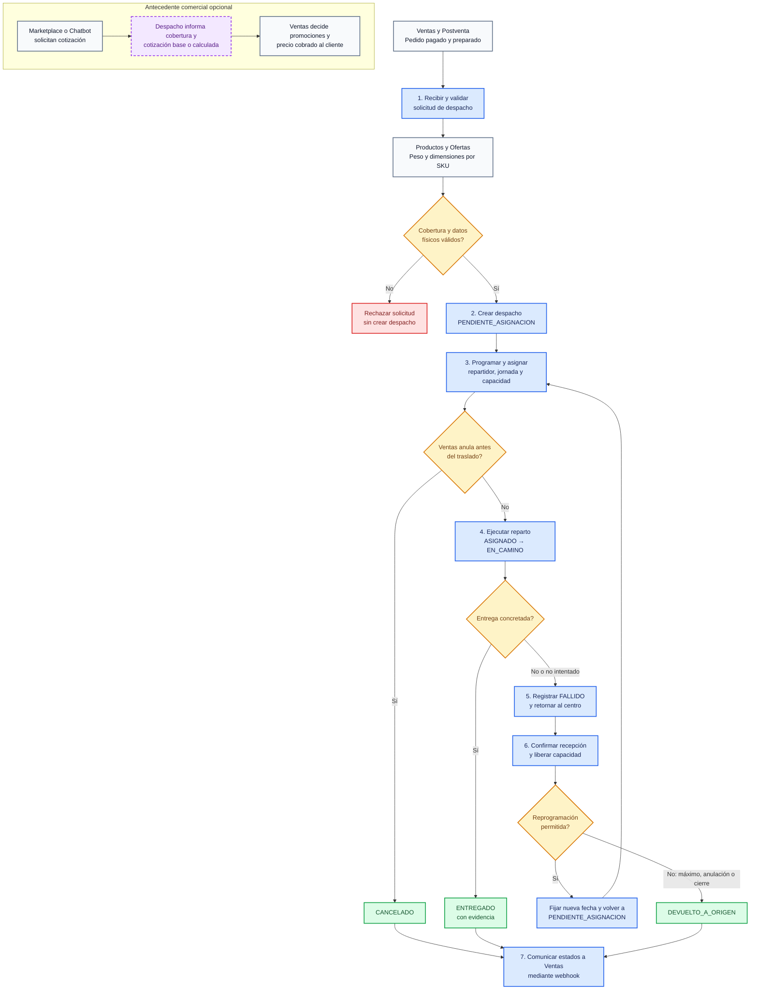

# Macroproceso de Despacho y Entrega

## 1. Alcance del macroproceso

La cotización ocurre antes de la creación del despacho y sirve como antecedente comercial. El macroproceso operativo comienza cuando Ventas y Postventa envía un pedido pagado, preparado y listo para entrega. Termina en uno de tres resultados finales:

- `ENTREGADO` al destinatario.
- `CANCELADO` antes de comenzar el traslado.
- `DEVUELTO_A_ORIGEN` en el centro de despacho.

## 2. Vista general

Para mantener la vista legible, el diagrama conecta el bloque de comunicación con los resultados finales. Sin embargo, el historial y el seguimiento se actualizan en cada transición, y cada cambio de estado confirmado genera también su notificación hacia Ventas y Postventa.

## 3. Procesos que componen el macroproceso

| Proceso | Responsable principal | Entrada | Resultado |
|---|---|---|---|
| 1. Recibir y validar | F-02 con apoyo de F-01 y Productos | Pedido, destinatario, destino y líneas | Solicitud rechazada o datos válidos para crear el despacho. |
| 2. Crear despacho | F-02 | Solicitud válida | Despacho `PENDIENTE_ASIGNACION`, zona, peso, volumen y fecha programada. |
| 3. Programar y asignar | F-02 con capacidad de F-05 | Despacho pendiente y jornada vigente | Despacho `ASIGNADO`, reserva y secuencia de ruta. |
| 4. Ejecutar reparto | F-03 | Ruta del repartidor | Despacho `EN_CAMINO` y luego resultado de la visita. |
| 5. Gestionar resultado | F-03 | Entrega o incidencia | `ENTREGADO` o `FALLIDO` con evidencia y motivo cuando corresponda. |
| 6. Resolver fallido | F-04 con liberación en F-05 | Paquete retornado al centro | Reprogramación o `DEVUELTO_A_ORIGEN`. |
| 7. Comunicar estados | Componente transversal de Gestión | Transición confirmada | Webhook idempotente hacia Ventas y seguimiento actualizado. |

## 4. Reglas de lectura para otros equipos

- Marketplace y Chatbot pueden solicitar una cotización base sin productos o una cotización calculada con productos. Ninguna de las dos crea el despacho.
- Despacho comunica un costo logístico; Ventas decide cuánto se cobra finalmente al cliente.
- Ventas no necesita volver a cotizar para crear el despacho. Envía las líneas y Despacho consulta nuevamente los datos físicos vigentes.
- Una cancelación solo termina en `CANCELADO` mientras el despacho está `PENDIENTE_ASIGNACION` o `ASIGNADO`.
- Si Ventas solicita cancelar cuando el despacho está `EN_CAMINO`, Despacho responde `409 Conflict`; el flujo continúa hasta entrega o fallo.
- Todo `FALLIDO` debe regresar al centro antes de reprogramarse o cerrarse.
- Un reintento regresa a asignación y recorre nuevamente el proceso de reparto.
- Los estados finales se notifican a Ventas, que continúa cualquier tratamiento comercial, reembolso o comunicación con el cliente.

## 5. Referencias

- [Glosario de dominio](./glosario-dominio.md).
- [Diagrama de estados del despacho](./diagrama-estados-despacho.md).
- [Contrato de comunicación](../integraciones/api-contract.md).
- [Visión general](../overview.md).
