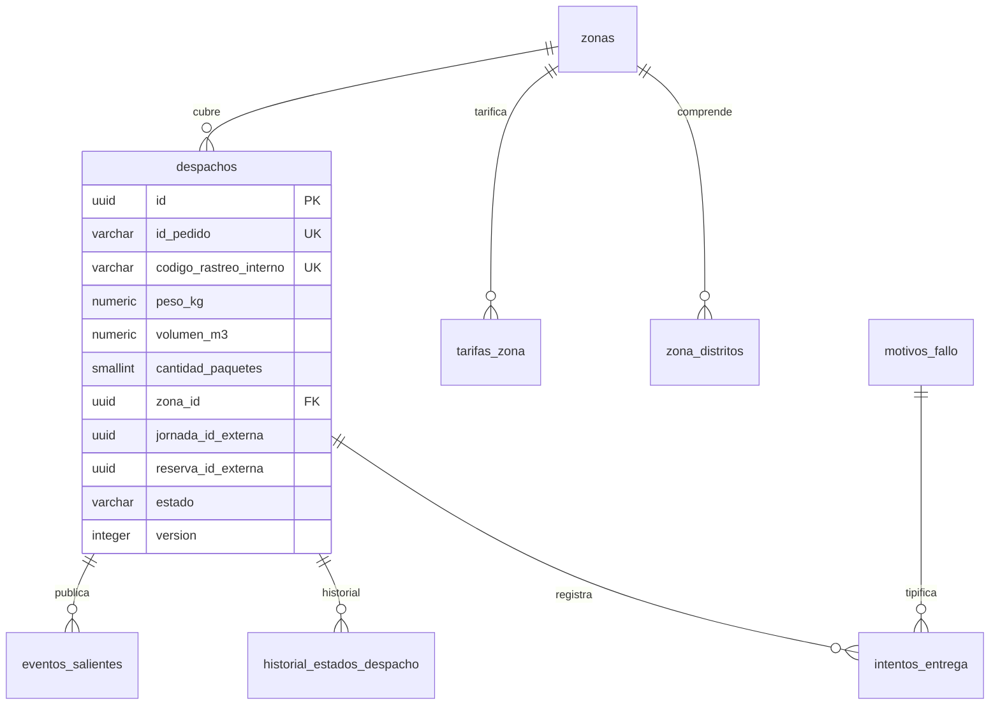
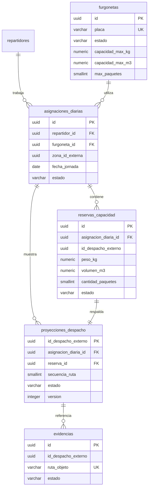

# Modelo de Datos: Módulo de Despacho y Entrega a Domicilio

Este documento define el modelo relacional de los dos microservicios del módulo de Despacho y Entrega, derivado de F-01 a F-05, de los requisitos transversales RT-01 a RT-04 del [overview](../overview.md), del [contrato de API propuesto](../integraciones/api-contract1.md) y del [C4 de contenedores](./c4-contenedores.md).

- **Gestión de Despachos:** F-01, F-02 y F-04; es dueño de zonas, tarifas, despacho canónico, intentos, recepción en centro, historial y eventos.
- **Operación de Reparto y Flota:** F-03 y F-05; es dueño de repartidores, furgonetas, jornadas, reservas de capacidad, proyección móvil y evidencias.

Cada microservicio usa una credencial de base de datos distinta. Para el curso pueden emplearse dos esquemas aislados en un mismo proyecto de Supabase, pero un servicio no consulta las tablas del otro y no existen claves foráneas ni relaciones JPA entre esquemas.

---

## 1. Decisiones de diseño

| Tema | Decisión | Motivo |
|---|---|---|
| Motor | PostgreSQL 15/16 en Supabase; PostGIS en Gestión de Despachos | La cobertura geográfica pertenece a F-01. |
| Persistencia | Dos esquemas o bases lógicas aisladas | Evita compartir tablas y modelos JPA entre microservicios. |
| Claves primarias | `UUID` generado con `gen_random_uuid()` | Los identificadores se exponen en APIs y eventos; no revelan volumen de operación ni son predecibles. |
| Código operativo | Columna única `codigo_rastreo_interno` | Facilita la operación interna; los canales consultan por `idPedido`. |
| Enumeraciones | `VARCHAR` con restricción `CHECK` | Se mapean directo con `@Enumerated(EnumType.STRING)` en JPA y son más simples de migrar que los tipos `ENUM`. |
| Borrado | Lógico, mediante columnas de estado (`estado_registro`, `activo`) | Repartidores, furgonetas y zonas con historial no pueden eliminarse. |
| Fechas | `TIMESTAMPTZ` en UTC para marcas temporales; `DATE` para jornadas y fechas programadas | La jornada se calcula en la zona horaria `America/Lima`. |
| Concurrencia | Columna `version` en `despachos` para bloqueo optimista (`@Version`) | Requerido por RT-01 y por las asignaciones de F-02. |
| Referencias entre servicios | Identificadores externos sin FK | Se validan mediante las APIs internas. |
| Datos derivados | La ocupación se calcula desde reservas de capacidad almacenadas por Operación | F-05 no consulta la tabla de despachos de Gestión. |
| Evidencias | Se guarda la ruta del objeto en el bucket privado, nunca el binario ni una URL | Las URL firmadas se emiten bajo demanda (F-03 RF-09). |
| Nomenclatura | `snake_case`, tablas en plural, columnas de auditoría `creado_en`, `actualizado_en`, `creado_por`, `actualizado_por` | Convención del repositorio. |

### 1.1. Cantidad de paquetes

Ventas y Postventa informa `cantidadPaquetes` cuando solicita el despacho del pedido ya preparado y sellado. El valor habitual y predeterminado es `1`: cinco polos dentro de una misma bolsa o caja siguen siendo un paquete. Solo será mayor cuando el pedido llegue físicamente en dos o más bultos independientes.

Este valor no representa la cantidad de productos. Gestión lo conserva en el despacho y Operación lo utiliza, junto con peso y volumen, para reservar capacidad en la furgoneta.

---

## 2. Diagramas entidad-relación

Las líneas siguientes representan únicamente relaciones dentro de cada persistencia. Los identificadores que cruzan de un servicio a otro no son claves foráneas.

### 2.1. Gestión de Despachos



### 2.2. Operación de Reparto y Flota



Las tablas de soporte también son locales a cada servicio. No existe una tabla compartida de idempotencia, configuración o auditoría.

---

## 3. Catálogo de tablas

Cada tabla indica qué microservicio y funcionalidad la escriben. Una funcionalidad del otro servicio accede mediante API o mediante una proyección, nunca con SQL directo.

### 3.1. Zonas y tarifas (Gestión de Despachos; escribe F-01)

#### `zonas`

| Columna | Tipo | Restricciones | Descripción |
|---|---|---|---|
| `id` | `UUID` | PK | Identificador. |
| `nombre` | `VARCHAR(80)` | NOT NULL, UNIQUE | Nombre de la zona ("Lima Centro"). |
| `estado` | `VARCHAR(10)` | NOT NULL, CHECK (`ACTIVO`, `INACTIVO`) | Solo las zonas activas se cotizan y aceptan despachos. |
| `geometria` | `GEOMETRY(MultiPolygon, 4326)` | NULL | Polígono dibujado en el mapa; opcional si la zona se define solo por distritos. |
| `creado_en`, `actualizado_en` | `TIMESTAMPTZ` | NOT NULL | Auditoría. |
| `creado_por`, `actualizado_por` | `VARCHAR(64)` | NOT NULL | Identificador de usuario de Seguridad. |

#### `zona_distritos`

| Columna | Tipo | Restricciones | Descripción |
|---|---|---|---|
| `id` | `UUID` | PK | Identificador. |
| `zona_id` | `UUID` | FK → `zonas`, NOT NULL | Zona a la que pertenece. |
| `distrito` | `VARCHAR(80)` | NOT NULL | Distrito cubierto. |
| `codigo_postal` | `VARCHAR(10)` | NULL | Código postal, si aplica. |

El backend valida que un distrito no pertenezca a dos zonas activas (F-01 CA-03), ya que la regla depende del estado de la zona.

#### `tarifas_zona`

| Columna | Tipo | Restricciones | Descripción |
|---|---|---|---|
| `id` | `UUID` | PK | Identificador. |
| `zona_id` | `UUID` | FK → `zonas`, NOT NULL | Zona tarificada. |
| `tarifa_base` | `NUMERIC(10,2)` | NOT NULL, CHECK (≥ 0) | Precio hasta el peso base. |
| `peso_base_kg` | `NUMERIC(10,3)` | NOT NULL, CHECK (> 0) | Peso incluido en la tarifa base. |
| `recargo_kg_adicional` | `NUMERIC(10,2)` | NOT NULL, CHECK (≥ 0) | Precio por kilogramo adicional. |
| `factor_volumetrico` | `NUMERIC(10,2)` | NULL, CHECK (> 0) | kg equivalentes por m³, cuando se informa volumen. |
| `moneda` | `CHAR(3)` | NOT NULL, DEFAULT `PEN` | Moneda de la tarifa. |
| `plazo_min_dias`, `plazo_max_dias` | `SMALLINT` | NOT NULL, CHECK (`plazo_min_dias` ≤ `plazo_max_dias`) | Plazo estimado en días hábiles. |
| `activa` | `BOOLEAN` | NOT NULL | Tarifa vigente. |
| `creado_en`, `creado_por` | — | NOT NULL | Auditoría. |

Índice único parcial: una sola tarifa activa por zona (`zona_id` WHERE `activa`). Un cambio de tarifa desactiva la anterior y crea una nueva, lo que conserva el histórico.

### 3.2. Flota y capacidad (Operación de Reparto y Flota; escribe F-05)

#### `repartidores`

| Columna | Tipo | Restricciones | Descripción |
|---|---|---|---|
| `id` | `UUID` | PK | Identificador (`idRepartidor`). |
| `nombres`, `apellidos` | `VARCHAR(80)` | NOT NULL | Datos personales. |
| `dni` | `VARCHAR(12)` | NOT NULL, UNIQUE | Documento de identidad (F-05 CA-02). |
| `telefono` | `VARCHAR(20)` | NOT NULL | Contacto. |
| `correo` | `VARCHAR(120)` | NOT NULL, UNIQUE | Usado para solicitar su cuenta a Seguridad. |
| `numero_brevete` | `VARCHAR(20)` | NOT NULL | Licencia de conducir. |
| `turno_habitual` | `VARCHAR(10)` | NOT NULL, CHECK (`MANANA`, `TARDE`, `COMPLETO`) | Turno de referencia. |
| `estado_registro` | `VARCHAR(10)` | NOT NULL, CHECK (`ACTIVO`, `INACTIVO`) | Baja lógica. |
| `id_usuario_seguridad` | `UUID` | NULL, UNIQUE | Usuario propiedad de Seguridad y Usuarios. |
| `estado_vinculacion` | `VARCHAR(25)` | NOT NULL, CHECK (`PENDIENTE`, `PENDIENTE_ACTIVACION`, `VINCULADO`, `ERROR`) | Solo `VINCULADO` permite abrir una jornada. |
| `ultimo_intento_vinculacion_en` | `TIMESTAMPTZ` | NULL | Última solicitud enviada a Seguridad. |
| `ultimo_error_vinculacion` | `VARCHAR(500)` | NULL | Diagnóstico visible para reintentar. |
| Auditoría | — | NOT NULL | `creado_en`, `actualizado_en`, `creado_por`, `actualizado_por`. |

Flujo recomendado:

1. Operación crea el repartidor con `estado_vinculacion=PENDIENTE`.
2. Solicita la cuenta a Seguridad con su token de servicio; nunca almacena ni recibe la contraseña definitiva.
3. Si Seguridad crea la cuenta y envía una invitación, se guarda `id_usuario_seguridad` y se cambia a `PENDIENTE_ACTIVACION`.
4. Cuando Seguridad confirma que la cuenta puede iniciar sesión, se cambia a `VINCULADO`.
5. Si la integración falla, se usa `ERROR` y el gestor puede reintentar.

La baja local mediante `estado_registro=INACTIVO` impide jornadas y asignaciones. Bloquear el acceso de la cuenta es una operación distinta que pertenece a Seguridad.

#### `furgonetas`

| Columna | Tipo | Restricciones | Descripción |
|---|---|---|---|
| `id` | `UUID` | PK | Identificador. |
| `placa` | `VARCHAR(10)` | NOT NULL, UNIQUE | Placa (F-05 CA-06). |
| `estado` | `VARCHAR(20)` | NOT NULL, CHECK (`DISPONIBLE`, `EN_MANTENIMIENTO`, `INACTIVA`) | `INACTIVA` es la baja lógica. |
| `capacidad_max_kg` | `NUMERIC(10,3)` | NOT NULL, CHECK (> 0) | Límite de peso. |
| `capacidad_max_m3` | `NUMERIC(10,4)` | NOT NULL, CHECK (> 0) | Límite de volumen. |
| `max_paquetes` | `SMALLINT` | NOT NULL, CHECK (> 0) | Máximo de paquetes en poder del repartidor. |
| Auditoría | — | NOT NULL | Igual que `repartidores`. |

#### `asignaciones_diarias`

Representa la jornada de un repartidor: con qué furgoneta y en qué zona trabaja ese día. Reemplaza a la tabla `turnos_operador` de la versión anterior.

| Columna | Tipo | Restricciones | Descripción |
|---|---|---|---|
| `id` | `UUID` | PK | Identificador de la jornada. |
| `repartidor_id` | `UUID` | FK → `repartidores`, NOT NULL | Repartidor. |
| `furgoneta_id` | `UUID` | FK → `furgonetas`, NOT NULL | Furgoneta. |
| `zona_id_externa` | `UUID` | NOT NULL, sin FK | Zona propiedad de Gestión de Despachos. |
| `fecha_jornada` | `DATE` | NOT NULL | Día de la jornada. |
| `capacidad_max_kg`, `capacidad_max_m3`, `max_paquetes` | Igual que `furgonetas` | NOT NULL | Copia de los límites al abrir la jornada. |
| `estado` | `VARCHAR(10)` | NOT NULL, CHECK (`ACTIVA`, `CERRADA`) | Una jornada cerrada deja al repartidor `FUERA_DE_TURNO`. |
| `abierta_en`, `abierta_por` | — | NOT NULL | Apertura por `GESTOR_DESPACHO`. |
| `cerrada_en` | `TIMESTAMPTZ` | NULL | Momento del cierre. |
| `tipo_cierre` | `VARCHAR(25)` | NULL, CHECK (`REPARTIDOR`, `CORTE_AUTOMATICO`, `GESTOR_DESPACHO`, `MANTENIMIENTO`) | Quién o qué cerró la jornada. |

Índices únicos parciales: un repartidor y una furgoneta tienen como máximo una jornada activa por fecha (`(repartidor_id, fecha_jornada)` y `(furgoneta_id, fecha_jornada)` WHERE `estado = 'ACTIVA'`).

### 3.3. Despachos (Gestión de Despachos; escribe F-02 y transiciona RT-01)

#### `despachos`

| Columna | Tipo | Restricciones | Descripción |
|---|---|---|---|
| `id` | `UUID` | PK | Identificador (`idDespacho`). |
| `id_pedido` | `VARCHAR(50)` | NOT NULL, UNIQUE | Pedido de Ventas y Postventa; garantiza un despacho por pedido (F-02 CA-12). |
| `codigo_rastreo_interno` | `VARCHAR(20)` | NOT NULL, UNIQUE | Referencia operativa; los canales consultan por `id_pedido`. |
| `es_simulado` | `BOOLEAN` | NOT NULL, DEFAULT false | Despacho de prueba; no emite eventos (RT-CA-07). |
| `estado` | `VARCHAR(25)` | NOT NULL, CHECK (ver sección 4) | Estado actual. |
| `destinatario_nombre` | `VARCHAR(120)` | NOT NULL | Nombre del destinatario. |
| `destinatario_telefono` | `VARCHAR(20)` | NOT NULL | Teléfono de contacto. |
| `direccion` | `VARCHAR(200)` | NOT NULL | Dirección de entrega. |
| `referencia` | `VARCHAR(200)` | NULL | Referencia de la dirección. |
| `distrito` | `VARCHAR(80)` | NOT NULL | Distrito; se expone en el seguimiento. |
| `codigo_postal` | `VARCHAR(10)` | NULL | Código postal. |
| `ubicacion` | `GEOMETRY(Point, 4326)` | NULL | Coordenadas si Ventas las envía; solo se usan para resolver la zona. |
| `peso_kg` | `NUMERIC(10,3)` | NOT NULL, CHECK (> 0) | Peso del paquete sellado. |
| `volumen_m3` | `NUMERIC(10,4)` | NOT NULL, CHECK (> 0) | Volumen del paquete sellado. |
| `cantidad_paquetes` | `SMALLINT` | NOT NULL, DEFAULT 1, CHECK (> 0) | Bultos físicos recibidos desde Ventas. |
| `zona_id` | `UUID` | FK → `zonas`, NOT NULL | Zona resuelta por F-01 al recibir la solicitud. |
| `fecha_comprometida` | `DATE` | NOT NULL | Fecha prometida al cliente por Ventas. |
| `fecha_programada` | `DATE` | NOT NULL | Fecha en que puede asignarse; cambia al reprogramar (F-02 CA-14). |
| `en_cola_desde` | `TIMESTAMPTZ` | NULL | Última entrada a `PENDIENTE_ASIGNACION`; base del "tiempo en espera". |
| `repartidor_id_externo` | `UUID` | NULL, sin FK | Repartidor propiedad de Operación. |
| `asignacion_diaria_id_externa` | `UUID` | NULL, sin FK | Jornada propiedad de Operación. |
| `reserva_capacidad_id_externa` | `UUID` | NULL, sin FK, UNIQUE | Reserva vigente en Operación. |
| `secuencia_ruta` | `SMALLINT` | NULL, CHECK (> 0) | Posición en la ruta de la jornada. |
| `numero_intentos` | `SMALLINT` | NOT NULL, DEFAULT 0 | Intentos reales consumidos. |
| `pedido_anulado_en` | `TIMESTAMPTZ` | NULL | Anulación registrada sobre un despacho `FALLIDO` (F-02 CA-20). |
| `version` | `INTEGER` | NOT NULL, DEFAULT 0 | Bloqueo optimista. |
| Auditoría | — | NOT NULL | `creado_en`, `actualizado_en`. |

Restricciones adicionales:

- CHECK: los tres identificadores externos y `secuencia_ruta` no son nulos cuando `estado` es `ASIGNADO` o `EN_CAMINO`.
- Restricción única `DEFERRABLE INITIALLY DEFERRED` sobre `(asignacion_diaria_id_externa, secuencia_ruta)`, que permite reordenar la ruta dentro de una transacción.
- No existen FK hacia Operación. Gestión guarda los identificadores devueltos al reservar capacidad y los valida mediante la API interna.
- La asignación se confirma después de crear la reserva. Si Gestión no logra completar el cambio, solicita liberar la reserva con la misma clave idempotente.

### 3.4. Intentos y trazabilidad (Gestión de Despachos)

#### `motivos_fallo` (catálogo canónico consumido por F-03)

| Columna | Tipo | Restricciones | Descripción |
|---|---|---|---|
| `codigo` | `VARCHAR(30)` | PK | Código del motivo. |
| `etiqueta` | `VARCHAR(80)` | NOT NULL | Texto mostrado. |
| `seleccionable_en_campo` | `BOOLEAN` | NOT NULL | `false` para `NO_INTENTADO`. |
| `consume_intento` | `BOOLEAN` | NOT NULL | `false` para `NO_INTENTADO`. |
| `activo` | `BOOLEAN` | NOT NULL | Permite retirar motivos sin borrarlos. |

Datos iniciales: los siete motivos del Anexo B de F-03.

#### `intentos_entrega` (escribe F-03; F-04 completa la recepción)

Una fila por cada vez que un despacho sale de una ruta con resultado: entregado o fallido.

| Columna | Tipo | Restricciones | Descripción |
|---|---|---|---|
| `id` | `UUID` | PK | Identificador. |
| `despacho_id` | `UUID` | FK → `despachos`, NOT NULL | Despacho. |
| `asignacion_diaria_id_externa` | `UUID` | NOT NULL, sin FK | Jornada de Operación. |
| `repartidor_id_externo` | `UUID` | NOT NULL, sin FK | Repartidor ejecutor. |
| `resultado` | `VARCHAR(10)` | NOT NULL, CHECK (`ENTREGADO`, `FALLIDO`) | Resultado. |
| `motivo_codigo` | `VARCHAR(30)` | FK → `motivos_fallo`, NULL | Obligatorio si `resultado = 'FALLIDO'`. |
| `consume_intento` | `BOOLEAN` | NOT NULL | Copia del motivo al registrar; `false` en entregas y `NO_INTENTADO`. |
| `comentario` | `VARCHAR(500)` | NULL | Comentario del repartidor. |
| `nombre_receptor` | `VARCHAR(120)` | NULL | Nombre opcional de quien recibió (F-03 CA-15). |
| `evidencia_id_externa` | `UUID` | NULL, sin FK, UNIQUE | Evidencia propiedad de Operación; obligatoria salvo en `NO_INTENTADO`. |
| `origen` | `VARCHAR(12)` | NOT NULL, CHECK (`MANUAL`, `AUTOMATICO`) | Registro del repartidor o corte automático. |
| `registrado_en` | `TIMESTAMPTZ` | NOT NULL | Marca temporal del servidor. |
| `recibido_en_centro_en` | `TIMESTAMPTZ` | NULL | Confirmación de retorno del paquete (F-04 RF-07). |
| `recibido_por` | `VARCHAR(64)` | NULL | Gestor que confirmó la recepción. |
| `sello_intacto` | `BOOLEAN` | NULL | Estado del sello al retornar. |
| `observacion_recepcion` | `VARCHAR(500)` | NULL | Observaciones de la recepción. |

Restricciones:

- CHECK: si `resultado = 'FALLIDO'`, `motivo_codigo` no es nulo.
- CHECK: si `resultado = 'ENTREGADO'` o `consume_intento = true`, `evidencia_id_externa` no es nulo.
- CHECK: los campos de recepción solo se completan cuando `resultado = 'FALLIDO'`.

Operación valida que la evidencia está cargada, pertenece al despacho y fue creada por el repartidor antes de enviar el comando interno. Gestión recibe el identificador desde el servicio autenticado y lo conserva sin FK porque la evidencia vive en Operación.

#### `evidencias` (Operación de Reparto y Flota; escribe F-03)

| Columna | Tipo | Restricciones | Descripción |
|---|---|---|---|
| `id` | `UUID` | PK | Identificador. |
| `despacho_id_externo` | `UUID` | NOT NULL, sin FK | Despacho canónico de Gestión. |
| `ruta_objeto` | `VARCHAR(300)` | NOT NULL, UNIQUE | Ruta en el bucket privado. |
| `tipo` | `VARCHAR(10)` | NOT NULL, CHECK (`ENTREGA`, `FALLO`) | Propósito autorizado. |
| `tipo_mime` | `VARCHAR(30)` | NOT NULL, CHECK (`image/jpeg`, `image/png`, `image/webp`) | Tipo de archivo. |
| `tamano_bytes` | `INTEGER` | NOT NULL, CHECK (> 0 y ≤ 2 097 152) | Máximo 2 MB (F-03 CA-18). |
| `estado` | `VARCHAR(12)` | NOT NULL, CHECK (`AUTORIZADA`, `CARGADA`, `ASOCIADA`, `EXPIRADA`) | Ciclo de la evidencia. |
| `cargado_por` | `VARCHAR(64)` | NOT NULL | Usuario repartidor. |
| `autorizada_en`, `cargado_en`, `asociada_en` | `TIMESTAMPTZ` | — | Marcas del ciclo. |
| `expira_en` | `TIMESTAMPTZ` | NOT NULL | Limpieza de cargas no asociadas. |

Si Gestión acepta la transición, Operación cambia la evidencia a `ASOCIADA`. Una tarea elimina objetos vencidos que nunca se asociaron.

#### `reservas_capacidad` (Operación de Reparto y Flota)

| Columna | Tipo | Restricciones | Descripción |
|---|---|---|---|
| `id` | `UUID` | PK | Identificador de reserva. |
| `despacho_id_externo` | `UUID` | NOT NULL | Despacho de Gestión. |
| `asignacion_diaria_id` | `UUID` | FK → `asignaciones_diarias`, NOT NULL | Jornada que transportará el paquete. |
| `peso_kg` | `NUMERIC(10,3)` | NOT NULL, CHECK (> 0) | Peso reservado. |
| `volumen_m3` | `NUMERIC(10,4)` | NOT NULL, CHECK (> 0) | Volumen reservado. |
| `cantidad_paquetes` | `SMALLINT` | NOT NULL, CHECK (> 0) | Bultos reservados. |
| `estado` | `VARCHAR(10)` | NOT NULL, CHECK (`ACTIVA`, `LIBERADA`) | Ocupación vigente. |
| `motivo_liberacion` | `VARCHAR(30)` | NULL | Entrega, cancelación, recepción, reasignación o compensación. |
| `creado_en`, `liberado_en` | `TIMESTAMPTZ` | — | Auditoría. |
| `version` | `INTEGER` | NOT NULL, DEFAULT 0 | Control de concurrencia. |

Un índice único parcial sobre `despacho_id_externo WHERE estado = 'ACTIVA'` garantiza una sola reserva vigente y permite conservar las reservas históricas. Un despacho `FALLIDO` conserva la reserva hasta que Gestión confirme su recepción en el centro. La reprogramación no reutiliza una reserva liberada: crea otra al volver a asignar el despacho.

#### `proyecciones_despacho` (Operación de Reparto y Flota)

| Columna | Tipo | Restricciones | Descripción |
|---|---|---|---|
| `despacho_id_externo` | `UUID` | PK | Despacho canónico de Gestión. |
| `id_pedido` | `VARCHAR(50)` | NOT NULL | Referencia del pedido. |
| `codigo_rastreo_interno` | `VARCHAR(20)` | NOT NULL | Referencia operativa. |
| `asignacion_diaria_id` | `UUID` | FK → `asignaciones_diarias`, NOT NULL | Jornada actual. |
| `reserva_capacidad_id` | `UUID` | FK → `reservas_capacidad`, NOT NULL, UNIQUE | Reserva que sustenta la ruta. |
| `secuencia_ruta` | `SMALLINT` | NOT NULL, CHECK (> 0) | Orden. |
| `estado` | `VARCHAR(25)` | NOT NULL | Copia del estado confirmado por Gestión. |
| `destinatario_nombre`, `destinatario_telefono` | `VARCHAR` | NOT NULL | Datos necesarios para entregar. |
| `direccion`, `referencia`, `distrito` | `VARCHAR` | — | Destino operativo. |
| `fecha_programada` | `DATE` | NOT NULL | Fecha de ruta. |
| `numero_intentos` | `SMALLINT` | NOT NULL | Contador confirmado. |
| `version` | `INTEGER` | NOT NULL | Versión canónica aplicada. |
| `actualizado_en` | `TIMESTAMPTZ` | NOT NULL | Última sincronización. |

La proyección permite que F-03 lea la ruta sin consultar la base de Gestión. Operación solicita cada transición a Gestión y solo actualiza esta copia con la respuesta o evento confirmado. Una versión repetida o anterior se ignora.

#### `historial_estados_despacho` (RT-02; escribe el componente común)

Tabla de solo inserción: sus filas nunca se modifican ni se eliminan.

| Columna | Tipo | Restricciones | Descripción |
|---|---|---|---|
| `id` | `UUID` | PK | Identificador. |
| `despacho_id` | `UUID` | FK → `despachos`, NOT NULL | Despacho. |
| `tipo_operacion` | `VARCHAR(25)` | NOT NULL, CHECK (`TRANSICION`, `REASIGNACION`, `REORDENAMIENTO`, `RECEPCION_EN_CENTRO`, `ANULACION_REGISTRADA`) | Las operaciones que no cambian el estado también quedan registradas. |
| `estado_anterior` | `VARCHAR(25)` | NULL | Nulo en la creación. |
| `estado_nuevo` | `VARCHAR(25)` | NOT NULL | Igual al anterior si la operación no cambia el estado. |
| `funcionalidad_origen` | `VARCHAR(5)` | NOT NULL, CHECK (`F-02`, `F-03`, `F-04`) | Funcionalidad que ejecutó la operación. |
| `ejecutor_tipo` | `VARCHAR(10)` | NOT NULL, CHECK (`USUARIO`, `SERVICIO`, `SISTEMA`) | Usuario, módulo externo o proceso automático. |
| `ejecutor_id` | `VARCHAR(64)` | NULL | Identificador del usuario o servicio. |
| `origen` | `VARCHAR(12)` | NOT NULL, CHECK (`MANUAL`, `AUTOMATICO`) | Origen de la operación. |
| `motivo_codigo` | `VARCHAR(30)` | FK → `motivos_fallo`, NULL | Motivo, en transiciones a `FALLIDO`. |
| `observaciones` | `VARCHAR(500)` | NULL | Observaciones. |
| `datos` | `JSONB` | NULL | Detalle propio de la operación: repartidor anterior y nuevo, nueva fecha, ocupación resultante (F-02 CA-11). |
| `registrado_en` | `TIMESTAMPTZ` | NOT NULL | Marca temporal del servidor. |

#### `eventos_salientes` (RT-03; escribe el componente común)

Implementa el patrón *outbox*: el evento se inserta en la misma transacción que la transición y un proceso asíncrono lo envía después.

| Columna | Tipo | Restricciones | Descripción |
|---|---|---|---|
| `id` | `UUID` | PK | Identificador del evento; se reenvía igual para que Ventas y Postventa descarte duplicados. |
| `despacho_id` | `UUID` | FK → `despachos`, NOT NULL | Despacho. |
| `destino` | `VARCHAR(25)` | NOT NULL, CHECK (`VENTAS`, `OPERACION_REPARTO`) | Consumidor del evento. |
| `tipo_evento` | `VARCHAR(40)` | NOT NULL, CHECK (tipos de la tabla de RT-03) | Tipo de evento. |
| `payload` | `JSONB` | NOT NULL | Contenido enviado a Ventas y Postventa. |
| `estado_envio` | `VARCHAR(15)` | NOT NULL, CHECK (`PENDIENTE`, `ENVIADO`, `ENVIO_FALLIDO`) | Estado del envío. |
| `intentos_envio` | `SMALLINT` | NOT NULL, DEFAULT 0 | Reintentos realizados; el máximo es configurable. |
| `proximo_intento_en` | `TIMESTAMPTZ` | NULL | Siguiente reintento con espera creciente. |
| `ultimo_error` | `VARCHAR(500)` | NULL | Último error recibido. |
| `creado_en`, `enviado_en` | `TIMESTAMPTZ` | — | Creación y envío exitoso. |

Los despachos simulados no generan eventos hacia Ventas. Los eventos hacia Operación llevan la versión del despacho para mantener la proyección ordenada.

### 3.5. Tablas de soporte por microservicio

#### `parametros_configuracion`

Cada microservicio mantiene solamente sus parámetros.

| Columna | Tipo | Restricciones | Descripción |
|---|---|---|---|
| `clave` | `VARCHAR(50)` | PK | Nombre del parámetro. |
| `valor` | `VARCHAR(100)` | NOT NULL | Valor. |
| `descripcion` | `VARCHAR(200)` | NOT NULL | Uso. |
| `actualizado_en`, `actualizado_por` | — | NOT NULL | Auditoría. |

Valores iniciales:

| Servicio | Clave | Valor inicial | Usado por |
|---|---|---|---|
| Gestión | `MAXIMO_INTENTOS` | `2` | F-04 |
| Operación | `HORA_CORTE_JORNADA` | `21:00` | F-03 CA-24 |
| Operación | `VIGENCIA_URL_FIRMADA_SEGUNDOS` | `300` | F-03 CA-27 |
| Gestión | `LIMITE_COTIZACIONES_POR_MINUTO` | `60` | F-01 CA-14 |
| Gestión | `MAXIMO_REINTENTOS_EVENTO` | `5` | RT-03 |

#### `auditoria_configuracion`

Cada servicio mantiene su propia auditoría: Gestión para zonas, tarifas y parámetros; Operación para repartidores, furgonetas y jornadas.

| Columna | Tipo | Restricciones | Descripción |
|---|---|---|---|
| `id` | `UUID` | PK | Identificador. |
| `entidad` | `VARCHAR(30)` | NOT NULL | Tabla afectada. |
| `entidad_id` | `VARCHAR(64)` | NOT NULL | Identificador del registro. |
| `accion` | `VARCHAR(20)` | NOT NULL, CHECK (`CREAR`, `MODIFICAR`, `CAMBIAR_ESTADO`) | Acción realizada. |
| `datos_anteriores`, `datos_nuevos` | `JSONB` | NULL | Valores antes y después. |
| `usuario_id` | `VARCHAR(64)` | NOT NULL | Usuario que ejecutó el cambio. |
| `registrado_en` | `TIMESTAMPTZ` | NOT NULL | Marca temporal en UTC. |

#### `claves_idempotencia`

| Columna | Tipo | Restricciones | Descripción |
|---|---|---|---|
| `id` | `UUID` | PK | Identificador. |
| `clave` | `VARCHAR(80)` | NOT NULL | Clave enviada por el cliente. |
| `actor_tipo` | `VARCHAR(10)` | NOT NULL, CHECK (`USUARIO`, `SERVICIO`) | Persona o módulo. |
| `actor_id` | `VARCHAR(80)` | NOT NULL | Claim `sub` del token. |
| `operacion` | `VARCHAR(50)` | NOT NULL | Operación protegida. |
| `huella_solicitud` | `VARCHAR(64)` | NOT NULL | Hash del cuerpo para impedir reutilizar la clave con otros datos. |
| `estado` | `VARCHAR(12)` | NOT NULL, CHECK (`EN_PROCESO`, `COMPLETADA`, `FALLIDA`) | Estado del procesamiento. |
| `codigo_respuesta` | `SMALLINT` | NULL | Código HTTP original. |
| `respuesta` | `JSONB` | NULL | Respuesta original. |
| `creado_en`, `expira_en` | `TIMESTAMPTZ` | NOT NULL | Vigencia de 24 horas. |

Cada microservicio tiene su propia tabla. Restricción única: `(actor_tipo, actor_id, operacion, clave)`.

Idempotencia significa que repetir una solicitud porque se perdió la respuesta no duplica el efecto. Por ejemplo, dos peticiones iguales de “Entregado” producen un solo intento y una sola transición. Incluso si finalmente no se exige el encabezado `Idempotency-Key` en todos los comandos, se mantienen las protecciones de negocio: `id_pedido` único, una reserva vigente por despacho y versiones de proyección crecientes.

---

## 4. Estados y valores permitidos

| Columna | Valores |
|---|---|
| `despachos.estado` | `PENDIENTE_ASIGNACION`, `ASIGNADO`, `EN_CAMINO`, `ENTREGADO`, `FALLIDO`, `DEVUELTO_A_ORIGEN`, `CANCELADO` |
| `zonas.estado` | `ACTIVO`, `INACTIVO` |
| `repartidores.estado_registro` | `ACTIVO`, `INACTIVO` |
| `repartidores.estado_vinculacion` | `PENDIENTE`, `PENDIENTE_ACTIVACION`, `VINCULADO`, `ERROR` |
| `furgonetas.estado` | `DISPONIBLE`, `EN_MANTENIMIENTO`, `INACTIVA` |
| `asignaciones_diarias.estado` | `ACTIVA`, `CERRADA` |
| `reservas_capacidad.estado` | `ACTIVA`, `LIBERADA` |
| `proyecciones_despacho.estado` | Mismos valores del despacho canónico |
| `intentos_entrega.resultado` | `ENTREGADO`, `FALLIDO` |
| `evidencias.estado` | `AUTORIZADA`, `CARGADA`, `ASOCIADA`, `EXPIRADA` |
| `eventos_salientes.estado_envio` | `PENDIENTE`, `ENVIADO`, `ENVIO_FALLIDO` |

Las transiciones válidas de `despachos.estado` están definidas en la sección 5 del overview; la base de datos solo restringe los valores y el backend valida las transiciones (RT-01).

---

## 5. Vista de ocupación en Operación

La ocupación se calcula exclusivamente con las reservas activas de Operación. No consulta `despachos` ni `intentos_entrega` de Gestión.

```sql
CREATE VIEW vista_ocupacion_repartidor AS
SELECT rep.id AS repartidor_id,
       a.id AS asignacion_diaria_id,
       a.zona_id_externa,
       a.capacidad_max_kg,
       a.capacidad_max_m3,
       a.max_paquetes,
       COALESCE(SUM(r.peso_kg) FILTER (WHERE r.estado = 'ACTIVA'), 0) AS ocupado_kg,
       COALESCE(SUM(r.volumen_m3) FILTER (WHERE r.estado = 'ACTIVA'), 0) AS ocupado_m3,
       COALESCE(SUM(r.cantidad_paquetes) FILTER (WHERE r.estado = 'ACTIVA'), 0) AS paquetes,
       CASE
           WHEN a.id IS NULL THEN 'FUERA_DE_TURNO'
           WHEN COALESCE(SUM(r.peso_kg) FILTER (WHERE r.estado = 'ACTIVA'), 0) >= a.capacidad_max_kg
             OR COALESCE(SUM(r.volumen_m3) FILTER (WHERE r.estado = 'ACTIVA'), 0) >= a.capacidad_max_m3
             OR COALESCE(SUM(r.cantidad_paquetes) FILTER (WHERE r.estado = 'ACTIVA'), 0) >= a.max_paquetes
             THEN 'SATURADO'
           WHEN EXISTS (
               SELECT 1
               FROM proyecciones_despacho p
               WHERE p.asignacion_diaria_id = a.id
                 AND p.estado = 'EN_CAMINO'
           ) THEN 'EN_RUTA'
           ELSE 'DISPONIBLE'
       END AS estado_operativo
FROM repartidores rep
LEFT JOIN asignaciones_diarias a
       ON a.repartidor_id = rep.id
      AND a.estado = 'ACTIVA'
      AND a.fecha_jornada = (now() AT TIME ZONE 'America/Lima')::date
LEFT JOIN reservas_capacidad r ON r.asignacion_diaria_id = a.id
WHERE rep.estado_registro = 'ACTIVO'
GROUP BY rep.id, a.id;
```

La operación que crea una reserva debe bloquear la jornada o utilizar control optimista para impedir que dos asignaciones concurrentes excedan sus límites. Gestión consulta esta capacidad por API; nunca mediante SQL.

---

## 6. Índices

| Servicio | Tabla | Índice | Consulta que atiende |
|---|---|---|---|
| Gestión | `zonas` | GIST sobre `geometria` | Resolución por coordenadas |
| Gestión | `zona_distritos` | `(distrito)`, `(codigo_postal)` | Resolución de zona |
| Gestión | `despachos` | `(estado, fecha_programada)` | Cola y fallidos |
| Gestión | `despachos` | `(id_pedido)` UNIQUE | Seguimiento e idempotencia |
| Gestión | `despachos` | `(asignacion_diaria_id_externa, secuencia_ruta)` | Asignación y reordenamiento |
| Gestión | `intentos_entrega` | `(despacho_id, registrado_en)` | Historial de intentos |
| Gestión | `historial_estados_despacho` | `(despacho_id, registrado_en)` | Hitos públicos y auditoría |
| Gestión | `eventos_salientes` | `(estado_envio, proximo_intento_en)` | Reintentos |
| Operación | `asignaciones_diarias` | `(fecha_jornada, estado)` | Jornada actual |
| Operación | `reservas_capacidad` | `(asignacion_diaria_id, estado)` | Ocupación |
| Operación | `proyecciones_despacho` | `(asignacion_diaria_id, secuencia_ruta)` | Ruta móvil |
| Operación | `evidencias` | `(estado, expira_en)` | Limpieza de cargas |
| Ambos | `claves_idempotencia` | `(expira_en)` | Limpieza periódica |

---

## 7. Trazabilidad con las especificaciones

| Datos | Propietario | Origen o consumidores | Requisitos que soporta |
|---|---|---|---|
| `zonas`, `zona_distritos`, `tarifas_zona` | Gestión | F-01; F-02 y F-05 consumen por API | F-01 RF-01 a RF-04 |
| `despachos`, `intentos_entrega` | Gestión | F-02 y F-04; F-03 origina comandos | F-02, F-03 y F-04 |
| `historial_estados_despacho`, `eventos_salientes` | Gestión | RT-01 a RT-04 | Estados, seguimiento y eventos |
| `repartidores`, `furgonetas`, `asignaciones_diarias` | Operación | F-05 y F-03 | F-05 RF-01 a RF-07 |
| `reservas_capacidad` | Operación | F-02 consume por API; F-05 es propietario | Asignación y ocupación |
| `proyecciones_despacho`, `evidencias` | Operación | F-03 | Ruta, transición y evidencia |
| `claves_idempotencia` | Cada servicio | Usuarios y clientes técnicos | Reintentos seguros |
| `vista_ocupacion_repartidor` | Operación | F-05; Gestión consulta por API | F-05 RF-04, RF-05 y RF-07 |

---

## 8. Datos que no se guardan

- **Datos del pedido distintos del envío** (productos, montos, pagos): pertenecen a Ventas y Postventa; solo se guarda `id_pedido`.
- **Credenciales, contraseñas y roles:** pertenecen a Seguridad y Usuarios; solo se guarda `id_usuario_seguridad`.
- **Stock y productos:** pertenecen a Productos y Ofertas.
- **Binarios de las fotografías y URL firmadas:** la foto vive en el bucket y la URL se genera en cada solicitud.
- **Ubicación del repartidor:** no se captura GPS.
- **Tokens, secretos y scopes:** se validan o configuran, pero no se persisten en las tablas de negocio.
- **Ocupación y estado operativo del repartidor:** se calculan en Operación desde reservas activas.
- **Relaciones JPA o claves foráneas entre microservicios:** se sustituyen por identificadores externos y APIs internas.
