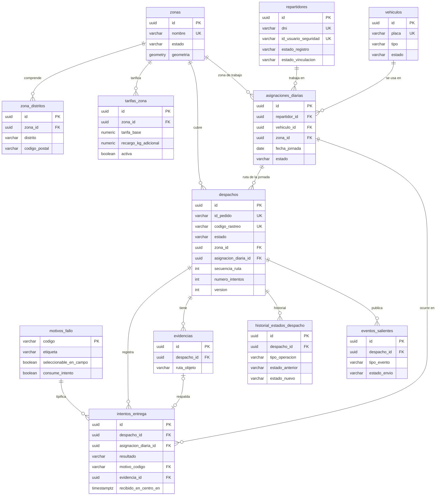

# Modelo de Datos: Módulo de Despacho y Entrega a Domicilio

Este documento define el modelo relacional de la base de datos del módulo de Despacho y Entrega, derivado de las especificaciones funcionales F-01 a F-05 y de los requisitos transversales RT-01 a RT-04 del [overview](../overview.md). La base de datos es exclusiva del módulo: no se comparten tablas con otros módulos y los datos externos (pedido, usuario) se guardan solo como identificadores de referencia.

---

## 1. Decisiones de diseño

| Tema | Decisión | Motivo |
|---|---|---|
| Motor | PostgreSQL 15/16 en Supabase, con extensión PostGIS | Requerido por el stack y por la cobertura geográfica de F-01. |
| Claves primarias | `UUID` generado con `gen_random_uuid()` | Los identificadores se exponen en APIs y eventos; no revelan volumen de operación ni son predecibles. |
| Códigos legibles | Columnas aparte y únicas (`codigo_rastreo`) | Los usuarios y canales usan códigos cortos; el UUID queda como identificador técnico. |
| Enumeraciones | `VARCHAR` con restricción `CHECK` | Se mapean directo con `@Enumerated(EnumType.STRING)` en JPA y son más simples de migrar que los tipos `ENUM`. |
| Borrado | Lógico, mediante columnas de estado (`estado_registro`, `activo`) | Repartidores, vehículos y zonas con historial no pueden eliminarse (F-01, F-05). |
| Fechas | `TIMESTAMPTZ` en UTC para marcas temporales; `DATE` para jornadas y fechas programadas | La jornada se calcula en la zona horaria `America/Lima`. |
| Concurrencia | Columna `version` en `despachos` para bloqueo optimista (`@Version`) | Requerido por RT-01 y por las asignaciones de F-02. |
| Datos derivados | La ocupación y el estado operativo del repartidor se calculan en una vista, no se almacenan | Regla de fuente única de F-05: ninguna funcionalidad guarda saldos de capacidad. |
| Evidencias | Se guarda la ruta del objeto en el bucket privado, nunca el binario ni una URL | Las URL firmadas se emiten bajo demanda (F-03 RF-09). |
| Nomenclatura | `snake_case`, tablas en plural, columnas de auditoría `creado_en`, `actualizado_en`, `creado_por`, `actualizado_por` | Convención del repositorio. |

---

## 2. Diagrama entidad-relación



Tablas de soporte sin relaciones de negocio: `parametros_configuracion`, `auditoria_configuracion` y `claves_idempotencia` (sección 3.5).

---

## 3. Catálogo de tablas

Cada tabla indica la funcionalidad que la **escribe**. Las demás funcionalidades pueden leerla dentro del mismo backend, pero no modificarla.

### 3.1. Zonas y tarifas (escribe F-01)

#### `zonas`

| Columna | Tipo | Restricciones | Descripción |
|---|---|---|---|
| `id` | `UUID` | PK | Identificador. |
| `nombre` | `VARCHAR(80)` | NOT NULL, UNIQUE | Nombre de la zona ("Lima Centro"). |
| `estado` | `VARCHAR(10)` | NOT NULL, CHECK (`ACTIVO`, `INACTIVO`) | Solo las zonas activas se cotizan y aceptan despachos. |
| `geometria` | `GEOMETRY(MultiPolygon, 4326)` | NULL | Polígono dibujado en el mapa; opcional si la zona se define solo por distritos. |
| `creado_en`, `actualizado_en` | `TIMESTAMPTZ` | NOT NULL | Auditoría. |
| `creado_por`, `actualizado_por` | `VARCHAR(64)` | NOT NULL | Identificador de usuario de Seguridad. |

#### `zona_distritos`

| Columna | Tipo | Restricciones | Descripción |
|---|---|---|---|
| `id` | `UUID` | PK | Identificador. |
| `zona_id` | `UUID` | FK → `zonas`, NOT NULL | Zona a la que pertenece. |
| `distrito` | `VARCHAR(80)` | NOT NULL | Distrito cubierto. |
| `codigo_postal` | `VARCHAR(10)` | NULL | Código postal, si aplica. |

El backend valida que un distrito no pertenezca a dos zonas activas (F-01 CA-03), ya que la regla depende del estado de la zona.

#### `tarifas_zona`

| Columna | Tipo | Restricciones | Descripción |
|---|---|---|---|
| `id` | `UUID` | PK | Identificador. |
| `zona_id` | `UUID` | FK → `zonas`, NOT NULL | Zona tarificada. |
| `tarifa_base` | `NUMERIC(10,2)` | NOT NULL, CHECK (≥ 0) | Precio hasta el peso base. |
| `peso_base_kg` | `NUMERIC(10,3)` | NOT NULL, CHECK (> 0) | Peso incluido en la tarifa base. |
| `recargo_kg_adicional` | `NUMERIC(10,2)` | NOT NULL, CHECK (≥ 0) | Precio por kilogramo adicional. |
| `factor_volumetrico` | `NUMERIC(10,2)` | NULL, CHECK (> 0) | kg equivalentes por m³, cuando se informa volumen. |
| `moneda` | `CHAR(3)` | NOT NULL, DEFAULT `PEN` | Moneda de la tarifa. |
| `plazo_min_dias`, `plazo_max_dias` | `SMALLINT` | NOT NULL, CHECK (`plazo_min_dias` ≤ `plazo_max_dias`) | Plazo estimado en días hábiles. |
| `activa` | `BOOLEAN` | NOT NULL | Tarifa vigente. |
| `creado_en`, `creado_por` | — | NOT NULL | Auditoría. |

Índice único parcial: una sola tarifa activa por zona (`zona_id` WHERE `activa`). Un cambio de tarifa desactiva la anterior y crea una nueva, lo que conserva el histórico.

### 3.2. Flota y capacidad (escribe F-05)

#### `repartidores`

| Columna | Tipo | Restricciones | Descripción |
|---|---|---|---|
| `id` | `UUID` | PK | Identificador (`idRepartidor`). |
| `nombres`, `apellidos` | `VARCHAR(80)` | NOT NULL | Datos personales. |
| `dni` | `VARCHAR(12)` | NOT NULL, UNIQUE | Documento de identidad (F-05 CA-02). |
| `telefono` | `VARCHAR(20)` | NOT NULL | Contacto. |
| `correo` | `VARCHAR(120)` | NOT NULL | Usado para crear su usuario en Seguridad. |
| `numero_brevete` | `VARCHAR(20)` | NOT NULL | Licencia de conducir. |
| `turno_habitual` | `VARCHAR(10)` | NOT NULL, CHECK (`MANANA`, `TARDE`, `COMPLETO`) | Turno de referencia. |
| `estado_registro` | `VARCHAR(10)` | NOT NULL, CHECK (`ACTIVO`, `INACTIVO`) | Baja lógica. |
| `id_usuario_seguridad` | `VARCHAR(64)` | NULL, UNIQUE | Usuario vinculado en Seguridad y Usuarios. |
| `estado_vinculacion` | `VARCHAR(10)` | NOT NULL, CHECK (`PENDIENTE`, `VINCULADO`) | Sin vínculo no recibe asignación diaria (F-05 CA-15). |
| Auditoría | — | NOT NULL | `creado_en`, `actualizado_en`, `creado_por`, `actualizado_por`. |

#### `vehiculos`

| Columna | Tipo | Restricciones | Descripción |
|---|---|---|---|
| `id` | `UUID` | PK | Identificador. |
| `placa` | `VARCHAR(10)` | NOT NULL, UNIQUE | Placa (F-05 CA-06). |
| `tipo` | `VARCHAR(10)` | NOT NULL, CHECK (`MOTO`, `AUTO`, `FURGONETA`) | Tipo de unidad. |
| `estado` | `VARCHAR(20)` | NOT NULL, CHECK (`DISPONIBLE`, `EN_MANTENIMIENTO`, `INACTIVO`) | `INACTIVO` es la baja lógica. |
| `capacidad_max_kg` | `NUMERIC(10,3)` | NOT NULL, CHECK (> 0) | Límite de peso. |
| `capacidad_max_m3` | `NUMERIC(10,4)` | NOT NULL, CHECK (> 0) | Límite de volumen. |
| `max_paquetes` | `SMALLINT` | NOT NULL, CHECK (> 0) | Máximo de paquetes en poder del repartidor. |
| Auditoría | — | NOT NULL | Igual que `repartidores`. |

#### `asignaciones_diarias`

Representa la jornada de un repartidor: con qué vehículo y en qué zona trabaja ese día. Reemplaza a la tabla `turnos_operador` de la versión anterior.

| Columna | Tipo | Restricciones | Descripción |
|---|---|---|---|
| `id` | `UUID` | PK | Identificador de la jornada. |
| `repartidor_id` | `UUID` | FK → `repartidores`, NOT NULL | Repartidor. |
| `vehiculo_id` | `UUID` | FK → `vehiculos`, NOT NULL | Vehículo. |
| `zona_id` | `UUID` | FK → `zonas`, NOT NULL | Zona de trabajo. |
| `fecha_jornada` | `DATE` | NOT NULL | Día de la jornada. |
| `capacidad_max_kg`, `capacidad_max_m3`, `max_paquetes` | Igual que `vehiculos` | NOT NULL | Copia de los límites del vehículo al abrir la jornada, para que un cambio del vehículo no altere la jornada en curso. |
| `estado` | `VARCHAR(10)` | NOT NULL, CHECK (`ACTIVA`, `CERRADA`) | Una jornada cerrada deja al repartidor `FUERA_DE_TURNO`. |
| `abierta_en`, `abierta_por` | — | NOT NULL | Apertura por el Gestor de Flota. |
| `cerrada_en` | `TIMESTAMPTZ` | NULL | Momento del cierre. |
| `tipo_cierre` | `VARCHAR(20)` | NULL, CHECK (`REPARTIDOR`, `CORTE_AUTOMATICO`, `GESTOR_FLOTA`, `MANTENIMIENTO`) | Quién o qué cerró la jornada (F-03 RF-07, F-05 CA-07 y CA-17). |

Índices únicos parciales: un repartidor y un vehículo tienen como máximo una jornada activa por fecha (`(repartidor_id, fecha_jornada)` y `(vehiculo_id, fecha_jornada)` WHERE `estado = 'ACTIVA'`).

### 3.3. Despachos (escribe F-02; transiciones mediante RT-01)

#### `despachos`

| Columna | Tipo | Restricciones | Descripción |
|---|---|---|---|
| `id` | `UUID` | PK | Identificador (`idDespacho`). |
| `id_pedido` | `VARCHAR(50)` | NOT NULL, UNIQUE | Pedido de Ventas y Postventa; garantiza un despacho por pedido (F-02 CA-12). |
| `codigo_rastreo` | `VARCHAR(20)` | NOT NULL, UNIQUE | Código legible para canales y cliente. |
| `es_simulado` | `BOOLEAN` | NOT NULL, DEFAULT false | Despacho de prueba; no emite eventos (RT-CA-07). |
| `estado` | `VARCHAR(25)` | NOT NULL, CHECK (ver sección 4) | Estado actual. |
| `destinatario_nombre` | `VARCHAR(120)` | NOT NULL | Nombre del destinatario. |
| `destinatario_telefono` | `VARCHAR(20)` | NOT NULL | Teléfono de contacto. |
| `direccion` | `VARCHAR(200)` | NOT NULL | Dirección de entrega. |
| `referencia` | `VARCHAR(200)` | NULL | Referencia de la dirección. |
| `distrito` | `VARCHAR(80)` | NOT NULL | Distrito; se expone en el seguimiento. |
| `codigo_postal` | `VARCHAR(10)` | NULL | Código postal. |
| `ubicacion` | `GEOMETRY(Point, 4326)` | NULL | Coordenadas si Ventas las envía; solo se usan para resolver la zona. |
| `peso_kg` | `NUMERIC(10,3)` | NOT NULL, CHECK (> 0) | Peso del paquete sellado. |
| `volumen_m3` | `NUMERIC(10,4)` | NOT NULL, CHECK (> 0) | Volumen del paquete sellado. |
| `zona_id` | `UUID` | FK → `zonas`, NOT NULL | Zona resuelta por F-01 al recibir la solicitud. |
| `fecha_comprometida` | `DATE` | NOT NULL | Fecha prometida al cliente por Ventas. |
| `fecha_programada` | `DATE` | NOT NULL | Fecha en que puede asignarse; cambia al reprogramar (F-02 CA-14). |
| `en_cola_desde` | `TIMESTAMPTZ` | NULL | Última entrada a `PENDIENTE_ASIGNACION`; base del "tiempo en espera". |
| `asignacion_diaria_id` | `UUID` | FK → `asignaciones_diarias`, NULL | Jornada y repartidor actuales; nulo en `PENDIENTE_ASIGNACION`. |
| `secuencia_ruta` | `SMALLINT` | NULL, CHECK (> 0) | Posición en la ruta de la jornada. |
| `numero_intentos` | `SMALLINT` | NOT NULL, DEFAULT 0 | Intentos reales consumidos. |
| `pedido_anulado_en` | `TIMESTAMPTZ` | NULL | Anulación registrada sobre un despacho `FALLIDO` (F-02 CA-20). |
| `version` | `INTEGER` | NOT NULL, DEFAULT 0 | Bloqueo optimista. |
| Auditoría | — | NOT NULL | `creado_en`, `actualizado_en`. |

Restricciones adicionales:

- CHECK: `asignacion_diaria_id` y `secuencia_ruta` no son nulos cuando `estado` es `ASIGNADO` o `EN_CAMINO`.
- Restricción única `DEFERRABLE INITIALLY DEFERRED` sobre `(asignacion_diaria_id, secuencia_ruta)`, que permite reordenar la ruta dentro de una transacción (F-02 CA-15).
- Los despachos no guardan `repartidor_id`: el repartidor se obtiene de la jornada, lo que evita inconsistencias entre ambos datos.

### 3.4. Ejecución, evidencias y trazabilidad

#### `motivos_fallo` (catálogo de F-03)

| Columna | Tipo | Restricciones | Descripción |
|---|---|---|---|
| `codigo` | `VARCHAR(30)` | PK | Código del motivo. |
| `etiqueta` | `VARCHAR(80)` | NOT NULL | Texto mostrado. |
| `seleccionable_en_campo` | `BOOLEAN` | NOT NULL | `false` para `NO_INTENTADO`. |
| `consume_intento` | `BOOLEAN` | NOT NULL | `false` para `NO_INTENTADO`. |
| `activo` | `BOOLEAN` | NOT NULL | Permite retirar motivos sin borrarlos. |

Datos iniciales: los siete motivos del Anexo B de F-03.

#### `intentos_entrega` (escribe F-03; F-04 completa la recepción)

Una fila por cada vez que un despacho sale de una ruta con resultado: entregado o fallido.

| Columna | Tipo | Restricciones | Descripción |
|---|---|---|---|
| `id` | `UUID` | PK | Identificador. |
| `despacho_id` | `UUID` | FK → `despachos`, NOT NULL | Despacho. |
| `asignacion_diaria_id` | `UUID` | FK → `asignaciones_diarias`, NOT NULL | Jornada y repartidor del intento. |
| `resultado` | `VARCHAR(10)` | NOT NULL, CHECK (`ENTREGADO`, `FALLIDO`) | Resultado. |
| `motivo_codigo` | `VARCHAR(30)` | FK → `motivos_fallo`, NULL | Obligatorio si `resultado = 'FALLIDO'`. |
| `consume_intento` | `BOOLEAN` | NOT NULL | Copia del motivo al registrar; `false` en entregas y `NO_INTENTADO`. |
| `comentario` | `VARCHAR(500)` | NULL | Comentario del repartidor. |
| `nombre_receptor` | `VARCHAR(120)` | NULL | Nombre opcional de quien recibió (F-03 CA-15). |
| `evidencia_id` | `UUID` | FK → `evidencias`, NULL, UNIQUE | Fotografía; obligatoria salvo en `NO_INTENTADO`. |
| `origen` | `VARCHAR(12)` | NOT NULL, CHECK (`MANUAL`, `AUTOMATICO`) | Registro del repartidor o corte automático. |
| `registrado_en` | `TIMESTAMPTZ` | NOT NULL | Marca temporal del servidor. |
| `recibido_en_centro_en` | `TIMESTAMPTZ` | NULL | Confirmación de retorno del paquete (F-04 RF-07). |
| `recibido_por` | `VARCHAR(64)` | NULL | Gestor que confirmó la recepción. |
| `sello_intacto` | `BOOLEAN` | NULL | Estado del sello al retornar. |
| `observacion_recepcion` | `VARCHAR(500)` | NULL | Observaciones de la recepción. |

Restricciones:

- CHECK: si `resultado = 'FALLIDO'`, `motivo_codigo` no es nulo.
- CHECK: si `resultado = 'ENTREGADO'` o `consume_intento = true`, `evidencia_id` no es nulo.
- CHECK: los campos de recepción solo se completan cuando `resultado = 'FALLIDO'`.

#### `evidencias` (escribe F-03)

| Columna | Tipo | Restricciones | Descripción |
|---|---|---|---|
| `id` | `UUID` | PK | Identificador. |
| `despacho_id` | `UUID` | FK → `despachos`, NOT NULL | Despacho al que pertenece. |
| `ruta_objeto` | `VARCHAR(300)` | NOT NULL, UNIQUE | Ruta en el bucket privado. |
| `tipo_mime` | `VARCHAR(30)` | NOT NULL, CHECK (`image/jpeg`, `image/png`, `image/webp`) | Tipo de archivo. |
| `tamano_bytes` | `INTEGER` | NOT NULL, CHECK (> 0 y ≤ 2 097 152) | Máximo 2 MB (F-03 CA-18). |
| `cargado_por` | `VARCHAR(64)` | NOT NULL | Usuario repartidor. |
| `cargado_en` | `TIMESTAMPTZ` | NOT NULL | Momento de la carga. |

#### `historial_estados_despacho` (RT-02; escribe el componente común)

Tabla de solo inserción: sus filas nunca se modifican ni se eliminan.

| Columna | Tipo | Restricciones | Descripción |
|---|---|---|---|
| `id` | `UUID` | PK | Identificador. |
| `despacho_id` | `UUID` | FK → `despachos`, NOT NULL | Despacho. |
| `tipo_operacion` | `VARCHAR(25)` | NOT NULL, CHECK (`TRANSICION`, `REASIGNACION`, `REORDENAMIENTO`, `RECEPCION_EN_CENTRO`, `ANULACION_REGISTRADA`) | Las operaciones que no cambian el estado también quedan registradas. |
| `estado_anterior` | `VARCHAR(25)` | NULL | Nulo en la creación. |
| `estado_nuevo` | `VARCHAR(25)` | NOT NULL | Igual al anterior si la operación no cambia el estado. |
| `funcionalidad_origen` | `VARCHAR(5)` | NOT NULL, CHECK (`F-02`, `F-03`, `F-04`) | Funcionalidad que ejecutó la operación. |
| `ejecutor_tipo` | `VARCHAR(10)` | NOT NULL, CHECK (`USUARIO`, `SERVICIO`, `SISTEMA`) | Usuario, módulo externo o proceso automático. |
| `ejecutor_id` | `VARCHAR(64)` | NULL | Identificador del usuario o servicio. |
| `origen` | `VARCHAR(12)` | NOT NULL, CHECK (`MANUAL`, `AUTOMATICO`) | Origen de la operación. |
| `motivo_codigo` | `VARCHAR(30)` | FK → `motivos_fallo`, NULL | Motivo, en transiciones a `FALLIDO`. |
| `observaciones` | `VARCHAR(500)` | NULL | Observaciones. |
| `datos` | `JSONB` | NULL | Detalle propio de la operación: repartidor anterior y nuevo, nueva fecha, ocupación resultante (F-02 CA-11). |
| `registrado_en` | `TIMESTAMPTZ` | NOT NULL | Marca temporal del servidor. |

#### `eventos_salientes` (RT-03; escribe el componente común)

Implementa el patrón *outbox*: el evento se inserta en la misma transacción que la transición y un proceso asíncrono lo envía después.

| Columna | Tipo | Restricciones | Descripción |
|---|---|---|---|
| `id` | `UUID` | PK | Identificador del evento; se reenvía igual para que Ventas y Postventa descarte duplicados. |
| `despacho_id` | `UUID` | FK → `despachos`, NOT NULL | Despacho. |
| `tipo_evento` | `VARCHAR(40)` | NOT NULL, CHECK (tipos de la tabla de RT-03) | Tipo de evento. |
| `payload` | `JSONB` | NOT NULL | Contenido enviado a Ventas y Postventa. |
| `estado_envio` | `VARCHAR(15)` | NOT NULL, CHECK (`PENDIENTE`, `ENVIADO`, `ENVIO_FALLIDO`) | Estado del envío. |
| `intentos_envio` | `SMALLINT` | NOT NULL, DEFAULT 0, CHECK (≤ 5) | Reintentos realizados. |
| `proximo_intento_en` | `TIMESTAMPTZ` | NULL | Siguiente reintento con espera creciente. |
| `ultimo_error` | `VARCHAR(500)` | NULL | Último error recibido. |
| `creado_en`, `enviado_en` | `TIMESTAMPTZ` | — | Creación y envío exitoso. |

Los despachos simulados no generan filas en esta tabla.

### 3.5. Tablas de soporte

#### `parametros_configuracion`

| Columna | Tipo | Restricciones | Descripción |
|---|---|---|---|
| `clave` | `VARCHAR(50)` | PK | Nombre del parámetro. |
| `valor` | `VARCHAR(100)` | NOT NULL | Valor. |
| `descripcion` | `VARCHAR(200)` | NOT NULL | Uso. |
| `actualizado_en`, `actualizado_por` | — | NOT NULL | Auditoría. |

Valores iniciales:

| Clave | Valor inicial | Usado por |
|---|---|---|
| `MAXIMO_INTENTOS` | `2` | F-04 |
| `HORA_CORTE_JORNADA` | `21:00` | F-03 CA-24 |
| `VIGENCIA_URL_FIRMADA_SEGUNDOS` | `300` | F-03 CA-27 |
| `LIMITE_COTIZACIONES_POR_MINUTO` | `60` | F-01 CA-14 |
| `MAXIMO_REINTENTOS_EVENTO` | `5` | RT-03 |

#### `auditoria_configuracion`

Registra los cambios sobre zonas, tarifas, repartidores, vehículos y parámetros (F-01 y F-05).

| Columna | Tipo | Restricciones | Descripción |
|---|---|---|---|
| `id` | `UUID` | PK | Identificador. |
| `entidad` | `VARCHAR(30)` | NOT NULL | Tabla afectada. |
| `entidad_id` | `VARCHAR(64)` | NOT NULL | Identificador del registro. |
| `accion` | `VARCHAR(20)` | NOT NULL, CHECK (`CREAR`, `MODIFICAR`, `CAMBIAR_ESTADO`) | Acción realizada. |
| `datos_anteriores`, `datos_nuevos` | `JSONB` | NULL | Valores antes y después. |
| `usuario_id` | `VARCHAR(64)` | NOT NULL | Usuario que ejecutó el cambio. |
| `registrado_en` | `TIMESTAMPTZ` | NOT NULL | Marca temporal en UTC. |

#### `claves_idempotencia`

| Columna | Tipo | Restricciones | Descripción |
|---|---|---|---|
| `clave` | `VARCHAR(80)` | PK | Clave enviada por el cliente. |
| `usuario_id` | `VARCHAR(64)` | NOT NULL | Usuario que la envió; la misma clave de otro usuario se rechaza. |
| `operacion` | `VARCHAR(40)` | NOT NULL | Operación protegida. |
| `codigo_respuesta` | `SMALLINT` | NOT NULL | Código HTTP original. |
| `respuesta` | `JSONB` | NOT NULL | Respuesta original, devuelta ante un reintento (F-03 CA-22). |
| `creado_en`, `expira_en` | `TIMESTAMPTZ` | NOT NULL | Vigencia de 24 horas. |

---

## 4. Estados y valores permitidos

| Columna | Valores |
|---|---|
| `despachos.estado` | `PENDIENTE_ASIGNACION`, `ASIGNADO`, `EN_CAMINO`, `ENTREGADO`, `FALLIDO`, `DEVUELTO_A_ORIGEN`, `CANCELADO` |
| `zonas.estado` | `ACTIVO`, `INACTIVO` |
| `repartidores.estado_registro` | `ACTIVO`, `INACTIVO` |
| `repartidores.estado_vinculacion` | `PENDIENTE`, `VINCULADO` |
| `vehiculos.estado` | `DISPONIBLE`, `EN_MANTENIMIENTO`, `INACTIVO` |
| `asignaciones_diarias.estado` | `ACTIVA`, `CERRADA` |
| `intentos_entrega.resultado` | `ENTREGADO`, `FALLIDO` |
| `eventos_salientes.estado_envio` | `PENDIENTE`, `ENVIADO`, `ENVIO_FALLIDO` |

Las transiciones válidas de `despachos.estado` están definidas en la sección 5 del overview; la base de datos solo restringe los valores y el backend valida las transiciones (RT-01).

---

## 5. Vista de ocupación del repartidor

La ocupación y el estado operativo de F-05 se calculan con una vista, sin columnas almacenadas. Un paquete cuenta mientras está en poder del repartidor: despachos `ASIGNADO` o `EN_CAMINO` de su jornada, más los intentos `FALLIDO` cuyo paquete aún no se recibe en el centro.

```sql
CREATE VIEW vista_ocupacion_repartidor AS
WITH paquetes_en_poder AS (
    SELECT d.asignacion_diaria_id, d.peso_kg, d.volumen_m3,
           (d.estado = 'EN_CAMINO') AS en_camino
    FROM despachos d
    WHERE d.estado IN ('ASIGNADO', 'EN_CAMINO')
    UNION ALL
    SELECT i.asignacion_diaria_id, d.peso_kg, d.volumen_m3, false
    FROM intentos_entrega i
    JOIN despachos d ON d.id = i.despacho_id
    WHERE i.resultado = 'FALLIDO'
      AND i.recibido_en_centro_en IS NULL
),
carga AS (
    SELECT asignacion_diaria_id,
           COALESCE(SUM(peso_kg), 0)    AS ocupado_kg,
           COALESCE(SUM(volumen_m3), 0) AS ocupado_m3,
           COUNT(*)                     AS paquetes,
           BOOL_OR(en_camino)           AS tiene_en_camino
    FROM paquetes_en_poder
    GROUP BY asignacion_diaria_id
)
SELECT r.id AS repartidor_id,
       a.id AS asignacion_diaria_id,
       a.zona_id,
       a.capacidad_max_kg, a.capacidad_max_m3, a.max_paquetes,
       COALESCE(c.ocupado_kg, 0) AS ocupado_kg,
       COALESCE(c.ocupado_m3, 0) AS ocupado_m3,
       COALESCE(c.paquetes, 0)   AS paquetes,
       CASE
           WHEN a.id IS NULL THEN 'FUERA_DE_TURNO'
           WHEN COALESCE(c.ocupado_kg, 0) >= a.capacidad_max_kg
             OR COALESCE(c.ocupado_m3, 0) >= a.capacidad_max_m3
             OR COALESCE(c.paquetes, 0)   >= a.max_paquetes THEN 'SATURADO'
           WHEN COALESCE(c.tiene_en_camino, false) THEN 'EN_RUTA'
           ELSE 'DISPONIBLE'
       END AS estado_operativo
FROM repartidores r
LEFT JOIN asignaciones_diarias a
       ON a.repartidor_id = r.id
      AND a.estado = 'ACTIVA'
      AND a.fecha_jornada = (now() AT TIME ZONE 'America/Lima')::date
LEFT JOIN carga c ON c.asignacion_diaria_id = a.id
WHERE r.estado_registro = 'ACTIVO';
```

F-05 consulta esta vista para el panel de monitoreo y para la consulta de disponibilidad (F-05 RF-05), y F-02 la usa para validar la capacidad antes de asignar.

---

## 6. Índices

| Tabla | Índice | Consulta que atiende |
|---|---|---|
| `zonas` | GIST sobre `geometria` | Resolución de zona por coordenadas (F-01 RF-04). |
| `zona_distritos` | `(distrito)` | Resolución de zona por distrito. |
| `despachos` | `(estado, fecha_programada)` | Cola de pendientes (F-02 CA-04) y entregas fallidas (F-04 CA-01). |
| `despachos` | `(asignacion_diaria_id, secuencia_ruta)` | Ruta del repartidor (F-03 CA-05). |
| `despachos` | `(zona_id)` | Filtro por zona. |
| `intentos_entrega` | `(asignacion_diaria_id)` WHERE `resultado = 'FALLIDO' AND recibido_en_centro_en IS NULL` | Ocupación y retornos atrasados (F-04 CA-18). |
| `intentos_entrega` | `(despacho_id, registrado_en)` | Historial de intentos. |
| `historial_estados_despacho` | `(despacho_id, registrado_en)` | Línea de tiempo y seguimiento (RT-04). |
| `eventos_salientes` | `(estado_envio, proximo_intento_en)` | Proceso de envío y reintentos. |
| `asignaciones_diarias` | `(fecha_jornada, estado)` | Corte automático y panel de flota. |
| `claves_idempotencia` | `(expira_en)` | Limpieza periódica de claves vencidas. |

---

## 7. Trazabilidad con las especificaciones

| Tabla | Escribe | Leen | Requisitos que soporta |
|---|---|---|---|
| `zonas`, `zona_distritos`, `tarifas_zona` | F-01 | F-02, F-05 | F-01 RF-01 a RF-04 |
| `repartidores`, `vehiculos`, `asignaciones_diarias` | F-05 | F-02, F-03 | F-05 RF-01 a RF-07; F-03 RF-01 y RF-07 |
| `despachos` | F-02 (transiciones vía RT-01) | Todas | F-02 RF-01 a RF-08; F-03 RF-02 a RF-06; F-04 RF-03 y RF-06 |
| `intentos_entrega` | F-03 (recepción: F-04) | F-04, F-05 | F-03 RF-05 a RF-07; F-04 RF-01, RF-02 y RF-07 |
| `evidencias` | F-03 | F-04 | F-03 RF-05, RF-06 y RF-09 |
| `motivos_fallo` | F-03 | F-04 | F-03 RF-10 |
| `historial_estados_despacho` | Componente común | F-02, F-04, RT-04 | RT-02, RT-04 |
| `eventos_salientes` | Componente común | Panel del Gestor | RT-03 |
| `parametros_configuracion` | `ADMIN` | Todas | F-01, F-03, F-04, RT-03 |
| `auditoria_configuracion` | F-01, F-05 | — | Trazabilidad de configuración |
| `claves_idempotencia` | F-03 | F-03 | F-03 CA-22 |
| `vista_ocupacion_repartidor` | — (vista) | F-02, F-05 | F-05 RF-04, RF-05 y RF-07 |

---

## 8. Datos que no se guardan

- **Datos del pedido distintos del envío** (productos, montos, pagos): pertenecen a Ventas y Postventa; solo se guarda `id_pedido`.
- **Credenciales, contraseñas y roles:** pertenecen a Seguridad y Usuarios; solo se guarda `id_usuario_seguridad`.
- **Stock y productos:** pertenecen a Productos y Ofertas.
- **Binarios de las fotografías y URL firmadas:** la foto vive en el bucket y la URL se genera en cada solicitud.
- **Ubicación del repartidor:** no se captura GPS.
- **Ocupación y estado operativo del repartidor:** se calculan en la vista de la sección 5.
