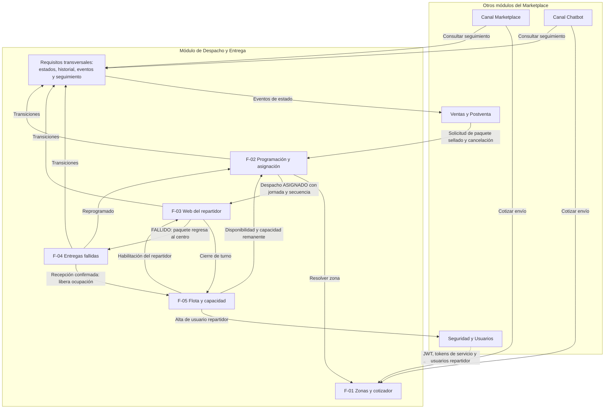
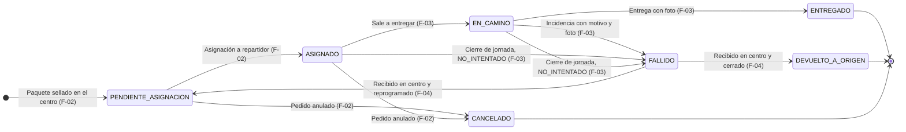

# Visión General: Módulo de Despacho y Entrega a Domicilio

Este documento describe el módulo de Despacho y Entrega a Domicilio del Marketplace Multicanal de productos deportivos: su propósito, la trazabilidad con los lineamientos del curso, la relación entre sus funcionalidades, el ciclo de vida del despacho y los requisitos transversales que todas las funcionalidades deben cumplir.

El detalle de cada funcionalidad vive en `funcionalidades/`, los endpoints en `integraciones/api-contract.md` y la persistencia en `arquitectura/modelo-datos.md`. Ante una diferencia entre este documento y una especificación funcional, prevalece la especificación y este documento debe corregirse.

---

## 1. Propósito y contexto

El módulo de Despacho y Entrega es uno de los siete módulos del Marketplace Multicanal. Su actor principal es el **Gestor de Despacho**.

Todos los pedidos de la tienda, sin importar el canal por el que se vendieron, se preparan en un **único centro de despacho**. Cuando un pedido ya fue pagado y su paquete está sellado en ese centro, Ventas y Postventa solicita el despacho. Desde ese momento el módulo se encarga de **enviar el paquete**: asignarlo a un repartidor, llevarlo al domicilio del cliente y, si la entrega no se concreta, traerlo de vuelta al centro de despacho.

El módulo es **dueño de la entidad despacho**. No es dueño del pedido ni del pago (Ventas y Postventa), del producto ni del stock (Productos y Ofertas), ni de los usuarios (Seguridad y Usuarios); esa información se obtiene exclusivamente mediante APIs.

### 1.1. Problemas que resuelve

- **Cobertura y costo de envío inciertos:** los canales necesitan saber, antes de confirmar un pedido, si el destino está cubierto y cuánto cuesta el envío.
- **Asignación sin información de capacidad:** sin saber quién está en turno y cuánta carga lleva, se sobrecarga a los repartidores o se asignan paquetes a vehículos inadecuados.
- **Entregas sin respaldo:** toda entrega, exitosa o fallida, queda respaldada por una fotografía trazable al repartidor que la registró.
- **Paquetes no entregados sin control:** todo paquete no entregado regresa al centro de despacho, su recepción se confirma y el Gestor decide si se reintenta o se cierra.
- **Falta de visibilidad del pedido:** Ventas y Postventa, los canales y el Gestor conocen cada avance del despacho a partir de sus cambios de estado.

### 1.2. Principios arquitectónicos

- **Microservicio con base de datos propia:** el módulo usa su propia base PostgreSQL y no accede a bases de datos de otros módulos.
- **Integración asíncrona entre módulos:** los cambios de estado se comunican mediante eventos asíncronos. Las solicitudes entrantes (cotización, solicitud y cancelación de despacho, seguimiento) se responden de inmediato, sin que Despacho quede a la espera de otro módulo.
- **Un solo backend para el módulo:** las cinco funcionalidades comparten backend y base de datos. Entre ellas no se exponen APIs internas; cada una respeta la propiedad de los datos de las demás.
- **Fuentes únicas:** F-01 es la única fuente de cobertura, F-05 la única de disponibilidad y ocupación, F-03 la única del catálogo de motivos de fallo, y la máquina de estados común (sección 6) la única vía para cambiar el estado de un despacho.
- **Desarrollo guiado por especificaciones (SDD):** las especificaciones son la fuente para el desarrollo asistido con IA y deben mantenerse coherentes entre sí.
- **Autonomía de pruebas:** el módulo genera despachos simulados para probarse sin depender de Ventas y Postventa.

---

## 2. Trazabilidad con los lineamientos del curso

| Lineamiento del curso | Dónde se cubre |
|---|---|
| Generación de solicitud de despacho a partir de un pedido | F-02 (RF-01, RF-05) |
| Asignación de despacho a operador/repartidor | F-02 (RF-03, RF-06, RF-07), apoyado por F-05 |
| Gestión de estados del despacho | Requisitos transversales RT-01 a RT-03 (sección 6) |
| Gestión de zonas y tarifas de entrega | F-01 |
| Seguimiento del pedido en ruta | Requisito transversal RT-04 (sección 6) |
| Registro de entrega y evidencia de recepción | F-03 (RF-05, RF-09) |
| Gestión de entregas fallidas/reprogramaciones | F-03 (RF-06, RF-07) y F-04 |

F-05 no figura como lineamiento propio; existe para que la asignación se haga sobre información confiable de disponibilidad y capacidad.

---

## 3. Funcionalidades y responsables

| ID | Funcionalidad | Responsable | Actor principal | Rol en el módulo |
|---|---|---|---|---|
| **F-01** | [Gestor de zonas geográficas y cotizador de envíos](funcionalidades/F-01-Gestor_ZonasGeograficas.md) | Valqui | Gestor de Despacho / Administrador | Zonas, tarifas, cotización para canales y resolución de zona para el módulo. |
| **F-02** | [Programación y asignación de despachos](funcionalidades/F-02-ProgramacionAsignacionDespachos.md) | Tarqui | Gestor de Despacho | Recepción, simulación, cola, asignación, secuencia, reasignación, cancelación y vista de ruta por repartidor. |
| **F-03** | [Web responsive del repartidor y evidencia de entrega](funcionalidades/F-03-AppMovilRepartidor.md) | Max Rojas | Repartidor | Ruta de la jornada, transiciones en campo, evidencia, cierre de jornada y catálogo de motivos. |
| **F-04** | [Entregas fallidas y reprogramaciones](funcionalidades/F-04-GestionEntregasFallidas.md) | Gerardo | Gestor de Despacho | Recepción de paquetes no entregados en el centro, reprogramación y cierre como devuelto a origen. |
| **F-05** | [Monitoreo de flota, operadores y capacidad diaria](funcionalidades/F-05-MonitoreoFlotaCapacidad.md) | Rhamses | Gestor de Flota | Repartidores, vehículos, jornadas, ocupación y disponibilidad. |

Los requisitos transversales de la sección 6 no constituyen una funcionalidad aparte: son un componente común del backend que F-02, F-03 y F-04 utilizan, y cada una verifica en sus pruebas las transiciones que ejecuta.

### 3.1. Flujo entre funcionalidades

### 3.2. Relaciones internas

| Origen | Destino | Qué se transfiere | Fuente |
|---|---|---|---|
| F-01 | F-02 | Zona del destino al registrar un despacho; rechazo si no hay cobertura. | F-01 RF-04, F-02 RF-05 |
| F-01 | F-05 | Zonas activas para la asignación diaria del repartidor. | F-05 RF-03 |
| F-05 | F-02 | Repartidores habilitados con capacidad remanente en kg, m³ y paquetes. | F-05 RF-05 |
| F-02 | F-03 | Despachos `ASIGNADO` con jornada, secuencia, destinatario, dirección y teléfono. | F-02 RF-06 |
| F-05 | F-03 | Repartidor vinculado al usuario del token y su estado operativo. | F-05 RF-06, RF-07 |
| F-03 | F-05 | Solicitud de cierre de turno al cerrar la jornada. | F-03 RF-07 |
| F-03 | F-04 | Despachos `FALLIDO` con motivo, contador, evidencia y catálogo de motivos. | F-03 RF-06, RF-09, RF-10 |
| F-04 | F-05 | Recepción del paquete en el centro, que deja de contar en la ocupación del repartidor. | F-04 RF-07 |
| F-04 | F-02 | Despachos reprogramados con nueva fecha programada. | F-04 RF-03 |
| F-02 | F-04 | Anulación del pedido sobre un despacho fallido. | F-02 CA-20, F-04 CA-15 |
| F-02, F-03, F-04 | Requisitos transversales | Solicitudes de transición de estado. | Sección 6 |

---

## 4. Actores y roles

| Rol | Actor | Uso |
|---|---|---|
| `GESTOR_DESPACHO` | Gestor de Despacho (actor principal) | F-01 (configuración), F-02, F-04 y consulta de disponibilidad de F-05 |
| `GESTOR_FLOTA` | Gestor de Flota | F-05 |
| `REPARTIDOR` | Repartidor en campo | F-03 |
| `ADMIN` | Administrador del módulo | Configuración de F-01 y F-05 |
| `SERVICIO_INTEGRACION` | Ventas y Postventa, Marketplace, Chatbot | Solicitud y cancelación de despachos (F-02) y consulta de seguimiento (RT-04) |
| Sin autenticación | Canales | Cotización (F-01), con límite de solicitudes |

Todos los roles son emitidos por Seguridad y Usuarios. El JWT del repartidor contiene su identificador de usuario; el módulo resuelve el repartidor correspondiente mediante el vínculo que mantiene F-05.

---

## 5. Ciclo de vida del despacho

El despacho tiene siete estados. Cada uno tiene una etiqueta pensada para el cliente y el Gestor, y responde a una pregunta simple: ¿dónde está el paquete?

| Estado | Etiqueta para el usuario | Dónde está el paquete | ¿Final? |
|---|---|---|---|
| `PENDIENTE_ASIGNACION` | En centro de despacho | Sellado en el centro, esperando repartidor | No |
| `ASIGNADO` | Asignado a repartidor | Reservado para un repartidor, pero todavía en el centro de despacho | No |
| `EN_CAMINO` | En camino | Recogido por el repartidor y fuera del centro, rumbo al destino | No |
| `ENTREGADO` | Entregado | Con el cliente | Sí |
| `FALLIDO` | No entregado, regresando al centro | Con el repartidor, de vuelta al centro | No |
| `DEVUELTO_A_ORIGEN` | De vuelta en el centro de despacho | En el centro, a disposición de Ventas y Postventa | Sí |
| `CANCELADO` | Cancelado | En el centro; el pedido fue anulado antes del traslado | Sí |

| Origen | Destino | Ejecuta | Contador de intentos |
|---|---|---|---|
| — | `PENDIENTE_ASIGNACION` | F-02 | Inicia en cero |
| `PENDIENTE_ASIGNACION` | `ASIGNADO` | F-02 | Sin efecto |
| `PENDIENTE_ASIGNACION` o `ASIGNADO` | `CANCELADO` | F-02 | Sin efecto |
| `ASIGNADO` | `EN_CAMINO` | F-03 | Sin efecto |
| `EN_CAMINO` | `ENTREGADO` | F-03 | Sin efecto |
| `EN_CAMINO` | `FALLIDO` | F-03 | Incrementa en uno |
| `ASIGNADO` o `EN_CAMINO` | `FALLIDO` (`NO_INTENTADO`) | F-03 | Sin efecto |
| `FALLIDO` (recibido en centro) | `PENDIENTE_ASIGNACION` | F-04 | Sin efecto |
| `FALLIDO` (recibido en centro) | `DEVUELTO_A_ORIGEN` | F-04 | Sin efecto |

La reasignación de F-02 cambia el repartidor de un despacho `ASIGNADO` sin cambiar su estado. La recepción del paquete en el centro (F-04) tampoco cambia el estado: es una confirmación registrada sobre el despacho `FALLIDO` que habilita la decisión del Gestor.

### 5.1. Reglas del ciclo de vida

1. **Origen único:** todo despacho nace de un pedido pagado cuyo paquete está sellado en el centro de despacho; hay un solo despacho por pedido.
2. **Cobertura obligatoria:** no se registra un despacho cuyo destino no esté cubierto por una zona activa.
3. **Jornada y secuencia:** solo se asignan despachos programados para hoy o antes; cada asignación define la jornada y la posición en la ruta.
4. **Capacidad:** ninguna asignación supera la capacidad remanente en kg, m³ o paquetes, calculada por F-05 a partir de los paquetes en poder del repartidor (`ASIGNADO`, `EN_CAMINO` y `FALLIDO` aún no recibidos en el centro).
5. **Evidencia obligatoria:** no se registra `ENTREGADO` ni `FALLIDO` por incidencia sin fotografía. No se captura firma ni geolocalización.
6. **Motivo tipificado:** todo `FALLIDO` lleva un motivo del catálogo de F-03: `CLIENTE_AUSENTE`, `DIRECCION_NO_UBICADA`, `RECHAZO_DEL_PAQUETE`, `DATOS_DE_CONTACTO_ERRONEOS`, `ZONA_INACCESIBLE`, `PAQUETE_DANADO`, y `NO_INTENTADO` como motivo exclusivo del sistema.
7. **Retorno al centro:** todo paquete no entregado regresa al centro de despacho; el Gestor no puede reprogramar ni cerrar un despacho sin confirmar esa recepción.
8. **Política de intentos:** el máximo es configurable, con valor inicial de dos. Al alcanzarlo, solo se permite cerrar como `DEVUELTO_A_ORIGEN`. Los `NO_INTENTADO` no consumen intentos.
9. **Cierre de jornada:** ningún despacho queda en `ASIGNADO` o `EN_CAMINO` al terminar la jornada del repartidor.
10. **Anulación del pedido:** antes del traslado se cancela el despacho; durante el traslado se rechaza; si el despacho está `FALLIDO`, solo puede cerrarse como `DEVUELTO_A_ORIGEN`.
11. **Inicio físico del traslado:** mientras el despacho está `ASIGNADO`, el paquete permanece en el centro. En el momento en que el repartidor lo recoge y sale del centro, F-03 debe cambiarlo a `EN_CAMINO`.

---

## 6. Requisitos transversales

Estos requisitos aplican a todo el módulo. Se implementan como un componente común del backend y no pertenecen a una sola funcionalidad.

### RT-01. Máquina de estados común

El sistema DEBE validar toda transición contra la tabla de la sección 5 y rechazar cualquier otra.

#### RT-CA-01. Transición válida

- **DADO** un despacho en `ASIGNADO`.
- **CUANDO** F-03 solicita la transición a `EN_CAMINO`.
- **ENTONCES** el estado cambia y se registra en el historial (RT-02).

#### RT-CA-02. Transición inválida

- **DADO** un despacho en `ENTREGADO`.
- **CUANDO** cualquier funcionalidad solicita una transición no prevista.
- **ENTONCES** se responde `409 Conflict`, el estado se conserva y no se registran historial ni evento.

#### RT-CA-03. Transiciones concurrentes

- **DADO** dos solicitudes simultáneas sobre el mismo despacho (por ejemplo, una cancelación de F-02 y un inicio de traslado de F-03).
- **CUANDO** ambas se procesan.
- **ENTONCES** solo una se aplica y la otra recibe `409 Conflict`.

### RT-02. Historial del despacho

El sistema DEBE conservar un historial único de cada despacho.

#### RT-CA-04. Registro del historial

- **DADO** una transición aceptada, una reasignación o una recepción en el centro.
- **CUANDO** se persiste.
- **ENTONCES** el historial guarda estado anterior, estado nuevo, funcionalidad origen, ejecutor, origen manual o automático, marca temporal del servidor en UTC, motivo y observaciones, en la misma transacción que el cambio.

### RT-03. Eventos hacia Ventas y Postventa

El sistema DEBE comunicar de forma asíncrona cada cambio de estado a Ventas y Postventa, dueño del ciclo de vida del pedido.

#### RT-CA-05. Evento por transición

- **DADO** una transición aceptada de un despacho no simulado.
- **CUANDO** se confirma la transacción.
- **ENTONCES** se registra un evento con identificador único, pedido, código de rastreo, estado nuevo y marca temporal, y se envía sin bloquear la operación que lo originó.

#### RT-CA-06. Ventas y Postventa no disponible

- **DADO** un evento pendiente.
- **CUANDO** Ventas y Postventa no responde o responde con error.
- **ENTONCES** se reintenta con espera creciente hasta cinco veces; si todos fallan, queda como `ENVIO_FALLIDO`, visible para el Gestor con opción de reenvío manual.

#### RT-CA-07. Duplicados y simulaciones

- **DADO** un reenvío o un despacho simulado.
- **CUANDO** se procesa el evento.
- **ENTONCES** el reenvío conserva el mismo identificador para que Ventas y Postventa descarte duplicados, y los despachos simulados no emiten eventos.

| Estado nuevo | Evento | Datos propios |
|---|---|---|
| `ASIGNADO` | `DESPACHO_ASIGNADO` | Fecha programada |
| `EN_CAMINO` | `DESPACHO_EN_CAMINO` | — |
| `ENTREGADO` | `DESPACHO_ENTREGADO` | Fecha y nombre de quien recibe, si se registró |
| `FALLIDO` | `DESPACHO_FALLIDO` | Motivo y número de intento |
| `PENDIENTE_ASIGNACION` (reprogramado) | `DESPACHO_REPROGRAMADO` | Nueva fecha programada |
| `DEVUELTO_A_ORIGEN` | `DESPACHO_DEVUELTO_A_ORIGEN` | Motivo del cierre |
| `CANCELADO` | `DESPACHO_CANCELADO` | — |

### RT-04. Seguimiento del pedido en ruta

El sistema DEBE permitir que los canales y el Gestor conozcan el avance de cada despacho a partir de sus estados. No incluye rastreo GPS.

#### RT-CA-08. Consulta de un canal

- **DADO** un despacho en `EN_CAMINO`.
- **CUANDO** un canal lo consulta por código de rastreo o por identificador de pedido con un token de servicio válido.
- **ENTONCES** recibe la etiqueta del estado ("En camino"), la fecha programada, el distrito de destino y los hitos con fecha, sin coordenadas, teléfono, dirección completa ni datos del repartidor.

#### RT-CA-09. Consulta inválida

- **DADO** un código o pedido sin despacho, o una consulta sin token de servicio.
- **CUANDO** llega al backend.
- **ENTONCES** se responde `404 Not Found` o `401 Unauthorized` respectivamente.

#### RT-CA-10. Hitos de un despacho no entregado

- **DADO** un despacho que falló y fue reprogramado.
- **CUANDO** se consulta.
- **ENTONCES** los hitos muestran "No entregado, regresando al centro" y "Entrega reprogramada para [fecha]", sin exponer el motivo ni el comentario del repartidor.

#### RT-CA-11. Seguimiento para el Gestor

- **DADO** una jornada en curso.
- **CUANDO** el Gestor abre la vista de ruta por repartidor de F-02 o el detalle de un despacho en F-02 o F-04.
- **ENTONCES** ve el estado actual de cada despacho, la hora de su último cambio y su historial completo, actualizados como máximo cada 30 segundos sin recargar la página.

---

## 7. Integración con otros módulos

Según la matriz cruzada del curso, Despacho y Entrega se integra con Marketplace, Chatbot, Ventas y Postventa, Productos y Ofertas y Seguridad y Usuarios. No se integra con Retail.

| Módulo | Dirección | Propósito | Dónde |
|---|---|---|---|
| Canal Marketplace | Entrante | Cotizar el envío y consultar el seguimiento del pedido. | F-01, RT-04 |
| Canal Chatbot | Entrante | Cotizar el envío y consultar el estado del pedido. | F-01, RT-04 |
| Ventas y Postventa | Entrante | Solicitar el despacho de un pedido pagado con paquete sellado, y su cancelación por anulación. | F-02 |
| Ventas y Postventa | Saliente | Recibir un evento por cada cambio de estado del despacho. | RT-03 |
| Productos y Ofertas | Sin intercambio directo previsto | El peso y el volumen del paquete sellado llegan en la solicitud; el reintegro de stock de un paquete devuelto lo gestiona Ventas y Postventa. | — |
| Seguridad y Usuarios | Bidireccional | Emitir JWT y tokens de servicio; crear los usuarios de los repartidores. | Todas, F-05 |

---

## 8. Acuerdos transversales

### 8.1. Seguridad

- El módulo no emite credenciales. Toda petición protegida incluye `Authorization: Bearer <token>` emitido por Seguridad y Usuarios.
- El backend valida rol y propiedad de los datos; un repartidor solo accede a sus despachos.
- Las evidencias se guardan en un bucket privado; la base de datos guarda la referencia y el acceso es por URL firmada de corta vigencia.

### 8.2. Convenciones de API

- JSON en `camelCase`, enumeraciones en `UPPER_SNAKE_CASE` y fechas ISO 8601 en UTC.
- Estructura común de errores definida en `integraciones/api-contract.md`.
- Listados paginados; operaciones de cambio de estado idempotentes y protegidas con bloqueo optimista.
- Los eventos se envían por webhook en la fase inicial; el publicador permite migrar a un broker de mensajería sin cambiar el dominio.

### 8.3. Despliegue

- Backend en Render, frontend en Vercel y base de datos en Supabase. La integración sobre `main` dispara construcción y pruebas automáticas.

---

## 9. Stack tecnológico

| Capa | Tecnología |
|---|---|
| Backend | Java 21, Spring Boot 4.1.1, Maven, Spring Web MVC, Spring Data JPA con Hibernate, Spring Security con JWT, Bean Validation, Lombok |
| Frontend | React con Vite y Tailwind CSS; dependencias en `arquitectura/stack-frontend.md` |
| Base de datos | PostgreSQL en Supabase, conexión mediante pooler y PostGIS para la cobertura de F-01 |
| Evidencias | Almacenamiento de objetos privado con URL firmadas; compresión en cliente y eliminación de EXIF |
| Mapas | Leaflet con OpenStreetMap para la delimitación de zonas |
| Pruebas | JUnit 5, Mockito, Spring Boot Test y Testcontainers |
| Documentación de API | Swagger UI desde el backend desplegado |
| Diseño | Figma |

---

## 10. Acuerdos pendientes

### 10.1. Con otros módulos

| Módulo | Acuerdo |
|---|---|
| Seguridad y Usuarios | Emisión de tokens de servicio con rol `SERVICIO_INTEGRACION`; API para crear usuarios con rol `REPARTIDOR`; contenido del JWT del repartidor. |
| Ventas y Postventa | Formato de la solicitud de despacho (paquete sellado, teléfono y referencia incluidos), de la cancelación y de los eventos; dirección de recepción de eventos. |
| Canal Marketplace y Canal Chatbot | Uso de la cotización pública y de la consulta de seguimiento con token de servicio. |

### 10.2. Dentro del equipo

- Acordar quién construye el componente común de la sección 6 (máquina de estados, historial, eventos y consulta de seguimiento), que las demás funcionalidades reutilizan.
- Actualizar `integraciones/api-contract.md`: estados `DEVUELTO_A_ORIGEN` y `CANCELADO`, catálogo de motivos, cuerpo de la evidencia (sin firma ni coordenadas), recepción en centro, endpoints nuevos de F-02 y F-05, y seguimiento con token de servicio.
- Actualizar `arquitectura/modelo-datos.md`: estados, jornada y secuencia del despacho, datos de recepción en centro, vínculo repartidor – usuario, zona de la asignación diaria y tabla de eventos.
- Actualizar el skill `.agent/skills/despacho-context`, el `README.md` y las historias de usuario afectadas.

---

## 11. Fuera del alcance del módulo

- **Preparación y sellado de paquetes:** ocurren en el centro de despacho antes de la solicitud.
- **Pagos, facturación, reembolsos, cambios, devoluciones comerciales y reclamos:** pertenecen a Ventas y Postventa.
- **Stock, inventario y catálogo de productos:** pertenecen a Productos y Ofertas.
- **Gestión de identidad y credenciales:** pertenece a Seguridad y Usuarios.
- **Notificación al cliente final:** corresponde a los canales y a Ventas y Postventa a partir de los eventos.
- **Ruteo optimizado y navegación:** el orden lo define el Gestor y la navegación usa aplicaciones externas.
- **Rastreo GPS en tiempo real:** el seguimiento se basa en los cambios de estado.
- **Operación sin conexión:** la web del repartidor requiere red activa.
- **Mantenimiento, seguros y costos de la flota:** se gestionan fuera del sistema.
