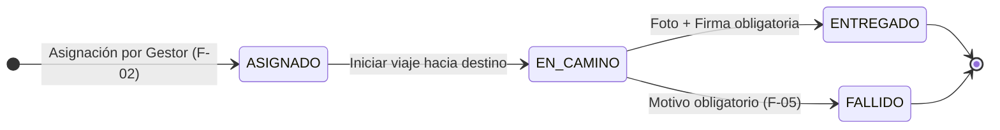

# Especificación: F-03 - App Móvil del Repartidor y Evidencia de Entrega

## 1. Contexto
En la logística de última milla, el repartidor en campo constituye el eslabón final que interactúa directamente con el cliente y el paquete físico. Para garantizar la visibilidad en tiempo real del progreso de la entrega y mitigar disputas de entrega, se requiere una aplicación web progresiva y responsiva (PWA) optimizada para dispositivos móviles. Esta herramienta permite al conductor consultar su hoja de ruta diaria, actualizar el estado operativo de cada paquete y registrar evidencia física incuestionable (fotografía georreferenciada y firma digital del receptor).

El componente opera de manera desacoplada: consume exclusivamente las APIs de autenticación, consulta y cambio de estado expuestas por el backend del módulo de Despacho, garantizando su independencia funcional frente a otros módulos externos del sistema.

## 2. Propósito
Proveer al repartidor de una interfaz web móvil fluida, ligera y confiable para gestionar su ruta de despachos asignados en el día, transicionar los estados operativos del paquete en tiempo real (`ASIGNADO` $\rightarrow$ `EN_CAMINO` $\rightarrow$ `ENTREGADO` / `FALLIDO`) y capturar evidencias digitales obligatorias tanto en entregas efectivas como en incidencias de ruta.

## 3. Alcance
Incluye:
- Autenticación móvil segura para operadores de reparto mediante credenciales y token JWT.
- Vista de "Mi Ruta": listado priorizado y ordenado de los despachos asignados en la jornada.
- Vista de "Detalle del Despacho": información de cliente, dirección, coordenadas, teléfono de contacto y lista de ítems.
- Máquina de estados controlada para el despacho con validaciones estrictas hacia adelante.
- Registro de entrega satisfactoria: captura obligatoria de fotografía del paquete mediante la cámara del dispositivo (con compresión en cliente), captura de firma digitalizada en pantalla y datos del receptor (nombre y documento de identidad).
- Registro de entrega fallida: selección obligatoria de motivo tipificado desde catálogo oficial y comentario explicativo.
- Soporte para operación resiliente ante desconexión o intermitencia de red móvil.

---

## 4. Máquina de Estados del Repartidor

El ciclo de vida del despacho desde la perspectiva del repartidor sigue una progresión estricta sin saltos arbitrarios ni retrocesos directos por parte del operador:

### Reglas de Transición
1. **Solo avance:** Un despacho en estado `ASIGNADO` únicamente puede pasar a `EN_CAMINO`.
2. **Evidencia mandatoria para `ENTREGADO`:** No es posible marcar `ENTREGADO` sin adjuntar al menos una fotografía legible y la firma digitalizada del receptor.
3. **Motivo mandatorio para `FALLIDO`:** No es posible marcar `FALLIDO` sin seleccionar un motivo válido del catálogo (`CLIENTE_AUSENTE`, `DIRECCION_NO_UBICADA`, `PAQUETE_RECHAZADO`, `ZONA_INACCESIBLE`).

---

## 5. Arquitectura de Pantallas (Wireframes de la PWA)

La aplicación web responsive se estructura en 5 vistas clave optimizadas para interacción táctil con una sola mano:

1. **Pantalla 1: Login del Repartidor**
   - Formulario de autenticación móvil con usuario/correo y contraseña.
   - Indicador de estado de conexión a internet.
2. **Pantalla 2: Mi Ruta (Lista de Despachos del Día)**
   - Resumen del día (total de paquetes asignados, entregados y pendientes).
   - Tarjetas de despacho ordenadas por prioridad de entrega con dirección, nombre del cliente y estado actual (`ASIGNADO`, `EN_CAMINO`).
3. **Pantalla 3: Detalle del Despacho**
   - Datos completos del destinatario, botón de llamada directa y botón de navegación en mapa (Waze / Google Maps).
   - Botón principal de acción: "Iniciar Recorrido" (transiciona a `EN_CAMINO`).
4. **Pantalla 4: Registro de Entrega Exitosa**
   - Visor de cámara para captura fotográfica con compresión automática en el navegador.
   - Lienzo (*canvas*) táctil para captura de firma del cliente.
   - Campos de texto para nombre y DNI de quien recibe.
   - Botón de confirmación: "Confirmar Entrega".
5. **Pantalla 5: Registro de Entrega Fallida**
   - Selector desplegable alimentado por el catálogo de motivos oficiales.
   - Área de texto para observaciones y notas del repartidor.
   - Captura opcional de foto de fachada/evidencia del fallo.
   - Botón de confirmación: "Registrar Fallo de Entrega".

---

## 6. Requisitos

### Requisito 1: Gestión de Hoja de Ruta Diaria
El sistema DEBE permitir al repartidor consultar de manera exclusiva los despachos que le han sido asignados para el día en curso.

#### Escenario: Consulta de ruta diaria con despachos activos
- DADO un repartidor autenticado con sesión activa y rol "Repartidor".
- CUANDO accede a la pantalla "Mi Ruta".
- ENTONCES el sistema consulta el backend y despliega únicamente los despachos vinculados a su identificador de operador, ordenados por secuencia programada.

#### Escenario: Sin despachos asignados para la jornada
- DADO un repartidor que ingresa a la aplicación en un día sin despachos asignados.
- CUANDO carga la vista principal.
- ENTONCES el sistema muestra un mensaje informativo claro: "No tienes despachos asignados para hoy".

### Requisito 2: Inicio de Ruta hacia el Destino
El sistema DEBE permitir transicionar un despacho desde `ASIGNADO` a `EN_CAMINO` cuando el conductor inicia el traslado.

#### Escenario: Transición exitosa a En Camino
- DADO un despacho en estado `ASIGNADO` asignado al repartidor autenticado.
- CUANDO el repartidor presiona "Iniciar Recorrido" en el detalle del paquete.
- ENTONCES el backend actualiza el estado a `EN_CAMINO`, registra la marca temporal y retorna confirmación con código `200 OK`.

### Requisito 3: Confirmación de Entrega con Evidencia Digital
El sistema DEBE exigir la captura fotográfica del paquete entregado y la firma del receptor antes de permitir el cambio a estado `ENTREGADO`.

#### Escenario: Entrega confirmada con evidencia completa
- DADO un despacho en estado `EN_CAMINO`.
- CUANDO el repartidor toma la fotografía del paquete, captura la firma digital del receptor en el lienzo táctil, ingresa nombre y DNI, y presiona "Confirmar Entrega".
- ENTONCES el sistema comprime las imágenes en el cliente, las envía al backend, transiciona el estado del despacho a `ENTREGADO` y emite la notificación correspondiente.

#### Escenario: Intento de entrega sin fotografía o firma
- DADO un despacho en estado `EN_CAMINO`.
- CUANDO el repartidor intenta enviar la confirmación sin haber tomado la fotografía obligatoria.
- ENTONCES la aplicación móvil bloquea el envío, resalta el campo faltante y muestra una alerta: "La evidencia fotográfica es obligatoria para confirmar la entrega".

### Requisito 4: Reporte de Entrega Fallida
El sistema DEBE permitir al repartidor marcar un despacho como `FALLIDO` seleccionando obligatoriamente un motivo oficial predefinido.

#### Escenario: Reporte exitoso de incidencia en ruta
- DADO un despacho en estado `EN_CAMINO` donde el cliente no se encuentra en el domicilio.
- CUANDO el repartidor selecciona el motivo `CLIENTE_AUSENTE`, agrega un comentario descriptivo y confirma la acción.
- ENTONCES el backend transiciona el estado a `FALLIDO`, almacena la incidencia en la bitácora y pone el despacho a disposición del Centro de Entregas Fallidas (F-05).

---

## 7. Requisitos no funcionales
- **Seguridad y Control de Acceso:** Validación obligatoria de token JWT con rol `REPARTIDOR`. Un repartidor no puede consultar ni modificar despachos pertenecientes a otro operador.
- **Rendimiento y Optimización de Datos Móviles:** La PWA debe comprimir las capturas fotográficas en el navegador (formato JPEG/WebP con calidad al 80% y resolución máxima de 1280x720) antes del envío, reduciendo el consumo de ancho de banda móvil a menos de 500 KB por evidencia.
- **Resiliencia ante Fallos de Red:** Si la conexión se interrumpe durante el envío de evidencia, la PWA debe retener la información localmente en `IndexedDB` y reintentar la sincronización automáticamente al restablecerse la red.

---

## 8. Fuera de alcance
- **Navegación GPS y cálculo de rutas en tiempo real:** La PWA delega el ruteo abriendo enlaces directos a Google Maps / Waze instalados en el celular del repartidor.
- **Cobro de pedidos contra entrega:** La gestión de pasarelas de pago o recaudación de efectivo corresponde al módulo de Pagos/Ventas.
- **Reprogramación de fechas o devoluciones a almacén:** Corresponde exclusivamente al Gestor en el Centro de Entregas Fallidas (F-05).

---

## 9. Matriz de Dependencias del Componente

| Dependencia Requerida | Módulo / Componente Proveedor |
| :--- | :--- |
| Pedido confirmado con identificador | Módulo de Ventas / Marketplace / Chatbot |
| Solicitud de despacho con dirección y coordenadas | Módulo de Despacho (F-02) |
| Asignación operativa del despacho al repartidor | Panel de Programación de Despachos (F-02) |
| APIs de cambio de estado y recepción de evidencia | Backend de Despacho (`specs/api-contract.md`) |
| Almacenamiento seguro de fotos y firmas | Servicio de Almacenamiento Backend de Despacho |
| Catálogo oficial de motivos de fallo | Módulo de Despacho (F-05 / Backend) |

---

## Criterio de completitud
La capacidad se considera correctamente implementada cuando:
- Todos los requisitos funcionales y escenarios Gherkin se cumplen satisfactoriamente.
- La máquina de estados (`ASIGNADO` $\rightarrow$ `EN_CAMINO` $\rightarrow$ `ENTREGADO` / `FALLIDO`) se cumple estrictamente sin transiciones inválidas.
- Las capturas fotográficas y firmas se comprimen y transmiten correctamente.
- La PWA es completamente responsiva y operable en navegadores móviles (Chrome Android / Safari iOS).
- No se incorporan elementos fuera del alcance establecido.
