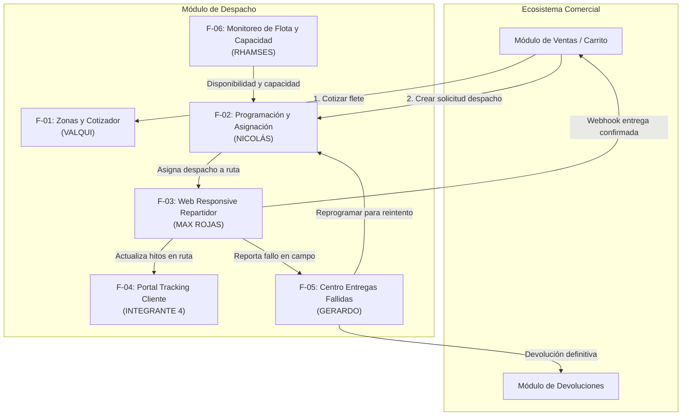
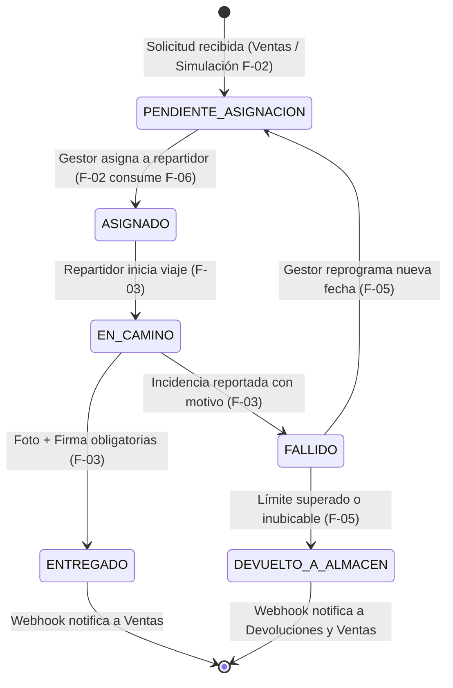

<<<<<<< HEAD
# Visión General del Proyecto

## Descripción
Sistema de logística de última milla orientado a microservicios. El proyecto gestiona el ciclo completo de entrega de paquetes: desde la cotización del envío hasta el cierre de la entrega o la resolución del incidente. El módulo en desarrollo actual es la **Web Responsive del Repartidor y Evidencia de Entrega**, una interfaz web mobile-first mediante la cual el repartidor en calle consulta su ruta del día, avanza el estado de cada despacho (`EN_CAMINO`, `ENTREGADO`, `FALLIDO`) y registra la evidencia que respalda el cierre: fotografía del paquete, firma y datos del receptor, o el motivo cuando la entrega no se concreta.

La capacidad no es dueña de la entidad `Despacho`: es el **punto de captura en campo** del estado real de la entrega. Su valor está en convertir un evento físico (el paquete se entregó o no) en un dato confiable, trazable y con respaldo probatorio dentro del sistema.

## Problema que resuelve
Sin una herramienta en campo, el estado de un despacho solo se conoce cuando el repartidor regresa al almacén y reporta verbalmente o en papel. Esto genera tres problemas operativos:

1. **Desfase de información**: el gestor de despacho y el cliente no saben dónde está el paquete hasta el final del día.
2. **Entregas sin respaldo**: no existe evidencia verificable de que el paquete fue entregado, ni a quién, lo que deriva en reclamos imposibles de resolver.
3. **Incidentes reportados tarde y sin estructura**: una entrega fallida se informa horas después y sin un motivo tipificado, por lo que no puede reprogramarse el mismo día ni analizarse después.

## Objetivos
| # | Objetivo | Indicador de logro |
|---|---|---|
| O1 | Permitir al repartidor consultar su ruta asignada del día desde su propio celular, sin instalar una aplicación nativa | El repartidor accede vía navegador móvil y visualiza solo los despachos asignados a él |
| O2 | Registrar el avance de estado de cada despacho en el momento en que ocurre | Cada transición queda persistida con fecha, hora y usuario que la ejecutó |
| O3 | Garantizar que toda entrega exitosa tenga evidencia adjunta | No es posible pasar a `ENTREGADO` sin fotografía y firma del receptor |
| O4 | Tipificar las entregas fallidas desde el campo | No es posible pasar a `FALLIDO` sin seleccionar un motivo del catálogo |
| O5 | Asegurar la integridad de la máquina de estados | El backend rechaza toda transición no permitida, independientemente de lo que envíe el cliente |

## Alcance
Se incluye dentro de esta capacidad:

- Autenticación del repartidor contra el módulo de Seguridad y mantenimiento de la sesión en el dispositivo.
- Listado de los despachos asignados al repartidor autenticado para la fecha actual.
- Detalle de un despacho: datos del cliente, dirección, referencia e ítems del pedido.
- Transición de estado `ASIGNADO → EN_CAMINO → ENTREGADO | FALLIDO`.
- Registro de entrega exitosa: captura de fotografía desde la cámara del dispositivo, compresión de la imagen en el cliente, firma del receptor y sus datos.
- Registro de entrega fallida: selección de motivo desde el catálogo y comentario libre.
- Manejo de errores de red y de respuestas de error del backend, con reintento explícito por parte del usuario.
- Entregables de especificación y soporte: diagrama de estados, wireframes de las 5 pantallas, contrato OpenAPI acordado con el backend de Despacho, casos de prueba con evidencia en dispositivo real y manual de uso del repartidor.

## Actores
| Actor | Tipo | Interacción con el módulo |
|---|---|---|
| **Repartidor** | Humano (usuario principal) | Inicia sesión, consulta su ruta, avanza estados y registra evidencia desde el navegador móvil |
| **Gestor de Despacho** | Humano (indirecto) | No opera esta app; consume el resultado de sus acciones desde el Panel de Asignación y el Centro de Entregas Fallidas |
| **Receptor del paquete** | Humano (indirecto) | Firma en el dispositivo del repartidor y entrega sus datos; no tiene cuenta en el sistema |
| **Backend de Despacho** | Sistema | Expone las APIs de listado, detalle, cambio de estado y carga de evidencia; es dueño de la entidad `Despacho` |
| **Módulo de Seguridad** | Sistema | Emite y respalda la validación de los tokens JWT |

## Stack Tecnológico
| Capa | Tecnología |
|---|---|
| **Frontend** | React 18+ / TypeScript / Vite — web responsive, mobile-first y orientada a navegador móvil |
| **Backend** | Java 21 / Spring Boot 3.x / Spring Security (Resource Server) |
| **Base de datos** | PostgreSQL (propia del módulo de Despacho) |
| **Autenticación** | JWT firmado con RS256 (Nimbus JOSE+JWT), emitido por el módulo de Seguridad; contraseñas con BCrypt |
| **Validación de token** | Local, contra la clave pública publicada en `/api/v1/auth/.well-known/jwks.json` |
| **Comunicación entre módulos** | APIs REST; notificaciones asíncronas hacia Ventas mediante función común del proyecto |
| **Metodología** | Spec-Driven Development (SDD) |

## Arquitectura
El sistema está diseñado como un conjunto de **microservicios independientes que no comparten base de datos**. Cada módulo es dueño exclusivo de sus entidades y expone su información mediante APIs REST; la integración con módulos externos al de Despacho es asíncrona.

La Web Responsive del Repartidor es un **cliente puro**: no posee tablas propias ni lógica de negocio autoritativa. Todas las reglas de transición de estado y de obligatoriedad de evidencia residen en el backend del módulo de Despacho; la interfaz las replica únicamente para dar retroalimentación inmediata al usuario.

### Módulos del Sistema
| Módulo | Responsabilidad | Relación con esta capacidad |
|---|---|---|
| **Seguridad** | Emisión y validación de JWT, registro y ciclo de vida de cuentas | Proveedor de identidad |
| **Despacho — Backend** | Dueño de la entidad `Despacho`, máquina de estados, almacenamiento de fotos y firmas, catálogo de motivos | Proveedor de todas las APIs consumidas |
| **Despacho — Panel de Asignación** (Integrante 2) | Asigna los despachos pendientes a un repartidor | Origina los despachos que la app lista |
| **Despacho — Monitoreo de Flota** (Integrante 6) | Maestro de repartidores, vehículos, turnos y capacidad diaria | Define qué repartidores existen y están habilitados |
| **Despacho — Entregas Fallidas** (Integrante 5) | Gestiona incidentes, reprograma o deriva a devolución | Consume los fallos registrados desde esta app |
| **Zonas y Cotizador** (Integrante 1) | Zonas de reparto y matriz de tarifas | Sin interacción directa |
| **Marketplace / Chatbot / Retail** | Origen del pedido | Sin interacción directa |
| **Ventas y Postventa** | Dueño de la entidad `Pedido`, flujos financieros | Recibe la notificación asíncrona al cerrarse la entrega |

### Flujo General de Despacho y Entrega
```
Pedido creado (Marketplace / Chatbot / Retail)
        │
        ▼
Solicitud de despacho con dirección y coordenadas
        │
        ▼
Gestor asigna el despacho a un repartidor (Panel de Asignación)
Estado: ASIGNADO
        │
        ▼
╔═════════════ ÁMBITO DE ESTA CAPACIDAD ═════════════╗
║                                                    ║
║  Repartidor inicia sesión (JWT del módulo          ║
║  de Seguridad) y consulta su ruta del día          ║
║        │                                           ║
║        ▼                                           ║
║  Marca inicio de traslado → EN_CAMINO              ║
║        │                                           ║
║        ├──────────────┬────────────────┐           ║
║        ▼              │                ▼           ║
║  Entrega exitosa      │        Entrega fallida     ║
║  foto + firma +       │        motivo + comentario ║
║  datos del receptor   │                │           ║
║        │              │                │           ║
║        ▼              │                ▼           ║
║  Estado: ENTREGADO    │        Estado: FALLIDO     ║
║                                                    ║
╚════════════════════════════════════════════════════╝
        │                                │
        ▼                                ▼
Notificación asíncrona          Centro de Entregas Fallidas
hacia Ventas y Postventa        (reprogramar o derivar a devolución)
```

### Máquina de Estados
```
   ASIGNADO ──────► EN_CAMINO ──────┬──────► ENTREGADO   (estado final)
                                    │
                                    └──────► FALLIDO     (estado final para esta app)
```
Reglas invariantes, validadas en el backend:

- Las transiciones son **solo hacia adelante**; no existe retroceso ni reapertura desde la app.
- `ENTREGADO` exige fotografía y firma previamente cargadas.
- `FALLIDO` exige un motivo perteneciente al catálogo vigente.
- Un despacho en estado final no admite nuevas transiciones desde esta app; su continuidad la decide el Centro de Entregas Fallidas.

## Autenticación y Seguridad
El módulo **no implementa autenticación propia**: delega la identidad en el módulo de Seguridad y actúa como *resource server*.

**Emisión.** El repartidor se autentica con `POST /api/v1/auth/login` enviando correo y contraseña. La respuesta entrega un token de acceso con vigencia de 15 minutos, un token de refresco con vigencia de 7 días —renovado en cada uso mediante `POST /auth/refresh`— y los datos básicos del usuario. Si la cuenta tiene segundo factor activo, primero se recibe un token de desafío y luego se valida un código de 6 dígitos en `/auth/otp/verificar`. Ante error, el módulo responde 401 con mensaje genérico si las credenciales son inválidas y 403 si la cuenta no está disponible.

**Contenido del token.** `sub` (id del usuario), `email`, `roles`, `permisos`, `tipo`, `iss`, `iat`/`exp` y `jti`.

**Validación.** El frontend envía el token en la cabecera `Authorization: Bearer <token>`. El backend de Despacho lo valida **localmente** contra la clave pública publicada en `/api/v1/auth/.well-known/jwks.json`, sin llamada por petición al módulo de Seguridad; `spring-boot-starter-oauth2-resource-server` cubre firma, expiración y emisor. Para operaciones sensibles se dispone de `/auth/introspeccion`, invocado con el token de servicio asignado al equipo, para confirmar el estado actual del usuario.

**Reglas propias de la capacidad.**

- Toda API consumida exige token válido; no existe endpoint anónimo salvo el propio login.
- El listado de despachos se filtra por el `sub` del token: un repartidor nunca accede a la ruta de otro.
- La autorización se verifica en el servidor en cada operación de cambio de estado; ocultar un botón en la interfaz no constituye control de acceso.
- Expirado el token de acceso, la app intenta la renovación de forma transparente; si el refresco también falla, se cierra la sesión y se solicita reingreso.

## Dependencias
| Dependencia | Módulo responsable |
|---|---|
| Pedido creado con su código | Marketplace / Chatbot / Retail |
| Solicitud de despacho con dirección y coordenadas | Despacho |
| Asignación del despacho al repartidor | Despacho (Panel de Asignación) |
| Identidad del repartidor y emisión de JWT | Seguridad |
| Maestro de repartidores habilitados | Despacho (Monitoreo de Flota) |
| APIs de cambio de estado y recepción de evidencia | Backend de Despacho |
| Almacenamiento de fotos y firmas | Backend de Despacho |
| Catálogo de motivos de entrega fallida | Despacho |

## Metodología: Spec-Driven Development (SDD)
El proyecto sigue un enfoque donde las **especificaciones se escriben antes del código**. Cada funcionalidad cuenta con:

1. **Especificación funcional** (`specs/Especificacion_*.md`): contexto, propósito, alcance, requisitos numerados con escenarios DADO/CUANDO/ENTONCES, requisitos no funcionales, fuera de alcance y criterio de completitud.
2. **Contrato de API** (`specs/api-contract.md`): documento OpenAPI/Swagger acordado y firmado con el equipo del backend de Despacho, con endpoints, formato de request/response y códigos de error.
3. **Agente** (`AGENT.md`): instrucciones que guían la generación de código respetando las specs.

### Convenciones de Código

#### Backend (Spring Boot 3)
- Patrón de capas: `Controller → Service → Repository`
- Endpoints REST: prefijo `/api/v1/`, nombres en plural kebab-case
- DTOs separados para entrada y salida (nunca exponer entidades directamente)
- Validación de la máquina de estados en la capa de servicio, no en el controlador
- Manejo de errores con códigos HTTP apropiados (400, 401, 403, 404, 409, 500)

#### Frontend (React + TypeScript)
- Estructura por feature: `features/<nombre-feature>/`
- Componentes funcionales con hooks
- Interfaces TypeScript para cada modelo de datos
- Servicios API centralizados en `services/`, con interceptor único para la cabecera `Authorization` y la renovación del token
- Compresión de imagen en el cliente antes de cualquier carga

## Fuera de Alcance (Capacidad Actual)
- **Modo offline y cola de sincronización**: se asume conectividad disponible en todo momento; ante fallo de red se informa el error y se ofrece reintento manual.
- **Captura de geolocalización GPS**: no se registran coordenadas del repartidor ni del punto de entrega.
- **Asignación y enrutamiento de despachos**: responsabilidad del Panel de Programación y Asignación (Integrante 2).
- **Reprogramación de entregas fallidas y derivación a devolución**: responsabilidad del Centro de Entregas Fallidas (Integrante 5).
- **Alta, baja y capacidad de repartidores y vehículos**: responsabilidad del Panel de Monitoreo de Flota (Integrante 6).
- **Cotización de envíos y zonas de reparto**: responsabilidad del Gestor de Zonas y Cotizador (Integrante 1).
- **Registro de usuarios, recuperación de contraseña y gestión del segundo factor**: responsabilidad del módulo de Seguridad.
- **Almacenamiento físico de fotos y firmas**: la app las captura y transmite; su persistencia es responsabilidad del backend de Despacho.
- **Reembolsos, notas de crédito y cualquier flujo financiero**: responsabilidad de Ventas y Postventa.
- **Aplicación móvil nativa o instalable**: la operación se realiza desde una web responsive en el navegador móvil y no requiere instalación.
=======
# Visión General de Arquitectura: Módulo de Despacho

Este documento presenta la visión integral del **Módulo de Despacho y Logística de Última Milla**: los problemas de negocio que resuelve, la interacción sistémica entre sus 6 componentes, los actores involucrados, la máquina de estados integral y las directrices transversales de seguridad, integración asíncrona y despliegue en nube.

---

## 1. Propósito y Problema de Negocio

El módulo de Despacho tiene la misión de orquestar y controlar el ciclo de vida del transporte de paquetes desde el momento en que un pedido es confirmado en los canales de venta hasta que se entrega de manera efectiva en manos del cliente final o se gestiona su devolución controlada.

En una arquitectura empresarial orientada a microservicios:
- **Autonomía de Datos:** El módulo opera con su propia base de datos aislada, sin compartir tablas directamente con Ventas, Inventario o Facturación.
- **Resiliencia Operativa:** Maneja picos de demanda, fallas transitorias de red en calle e independiza las pruebas y el desarrollo de cada integrante mediante mecanismos de simulación y desacoplamiento de contratos.

---

## 2. Mapa de Integrantes y Distribución de Responsabilidades

El módulo se compone de 6 capacidades especializadas, cada una liderada por un integrante con límites de dominio bien definidos:



| Integrante | Rol / Funcionalidad | Responsabilidad Principal |
| :--- | :--- | :--- |
| **Integrante 1 (Valqui)** | `F-01`: Zonas y Cotizador | Catálogo de cobertura y cálculo del costo de envío para carritos de compra. |
| **Integrante 2 (Nicolás)** | `F-02`: Programación y Asignación | Cola de pedidos pendientes, asignación según carga y pedidos de prueba para desarrollo. |
| **Integrante 3 (Max Rojas)** | `F-03`: Web Responsive del Repartidor | Interfaz web mobile-first para el repartidor: ruta diaria, transición de estados, fotos y firmas. |
| **Integrante 4** | `F-04`: Portal Tracking Cliente | Consulta pública de rastreo con línea de tiempo cronológica y mapa referencial. |
| **Integrante 5 (Gerardo)** | `F-05`: Centro de Entregas Fallidas | Resolución de paquetes no entregados, reprogramación de fecha o devolución a almacén. |
| **Integrante 6 (Rhamses)** | `F-06`: Monitoreo de Flota y Capacidad | Gestión de choferes, turnos, límites de carga vehicular y API de disponibilidad. |

---

## 3. Ciclo de Vida y Máquina de Estados del Despacho

Cada paquete transita por un flujo formal de estados gestionado por el backend:



---

## 4. Estrategia Transversal (DevOps, Seguridad y Arquitectura)

Dado que no existe un rol exclusivo de infraestructura, las responsabilidades transversales se organizan bajo los siguientes acuerdos de equipo:

### 4.1 Seguridad y JWT
- No existe un servidor de autenticación propio dentro de Despacho; se consumen los tokens emitidos por el módulo transversal de **Seguridad**.
- **Regla:** Cada integrante asegura sus propios endpoints en el backend inyectando la misma plantilla común de configuración de seguridad (validación de firma JWT y verificación de roles: `GESTOR_DESPACHO`, `GESTOR_FLOTA`, `REPARTIDOR`, `ADMIN`).

### 4.2 Integración Asíncrona / Webhooks Comunes
- Cuando un despacho pasa a estado `ENTREGADO` (F-03) o `DEVUELTO_A_ALMACEN` (F-05), el backend dispara un evento asíncrono hacia los módulos interesados (Ventas/Postventa y Devoluciones).
- **Regla:** Para no duplicar código, el proyecto cuenta con un servicio o función común (`NotificadorEventosService`) que encapsula la emisión HTTP asíncrona (código `202 Accepted`) y el esquema de reintentos con reintentos exponenciales.

### 4.3 Despliegue Continuo en la Nube
- Se designa a 1 integrante del equipo como **líder de despliegue** encargado de la configuración inicial de los proyectos en la nube (ej. Render para el backend Java/Spring Boot y Vercel para el frontend React).
- Todo el equipo integra sus ramas sobre `main`, activando despliegues automatizados tras cada *merge* validado.

---

## 5. Stack Tecnológico y Herramientas del Proyecto

La selección de herramientas responde a criterios de rendimiento moderno, compatibilidad LTS, bajo costo de despliegue y máxima autonomía para los 6 integrantes:

### 5.1 Backend
- **Lenguaje:** **Java 21 (LTS)** — Aprovecha *Virtual Threads* (Project Loom) para I/O concurrente de alto rendimiento, *Records* para DTOs inmutables y *Pattern Matching*.
- **Framework:** **Spring Boot 3.3.x** — Versión de referencia plenamente compatible con Java 21, Spring Framework 6 y Jakarta EE 10 *(aclaración técnica: la mención preliminar a 4.1.1 corresponde a la rama actual Spring Boot 3.x)*.
- **Gestor de Dependencias:** **Maven** (`pom.xml`) como estándar unificado del repositorio backend.
- **Capa Web y Servicios:** `spring-boot-starter-web` (Spring MVC para controladores RESTful).
- **Persistencia y ORM:** `spring-boot-starter-data-jpa` con Hibernate 6 para mapeo objeto-relacional y repositorios.
- **Productividad:** `org.projectlombok:lombok` (`@Getter`, `@Setter`, `@Builder`, `@RequiredArgsConstructor`) para reducir código repetitivo.
- **Conector de Base de Datos:** `org.postgresql:postgresql` (driver JDBC oficial).
- **Seguridad:** `spring-boot-starter-security` con soporte para validación sin estado de tokens Bearer JWT (`io.jsonwebtoken:jjwt`).
- **Pruebas y Calidad:** JUnit 5 (`junit-jupiter`), Mockito y AssertJ mediante `spring-boot-starter-test` para pruebas unitarias de servicios y controladores (`@WebMvcTest`).

### 5.2 Frontend
- **Framework & Tooling:** **React 18/19** configurado con **Vite** para compilación ultrarrápida y Hot Module Replacement (HMR).
- **Estilos:** **Tailwind CSS** para un diseño utilitario, modular y responsivo adaptado tanto a pantallas móviles como a dashboards de escritorio.
- **Suite de Dependencias Evaluadas y Justificadas:**
  - `react-router-dom`: Enrutamiento y control de vistas en la Single Page Application (SPA).
  - `axios`: Cliente HTTP con interceptores para inyección del header `Authorization: Bearer <JWT>` y manejo homogéneo de errores.
  - `@tanstack/react-query`: Manejo de estado del servidor, caché inteligente y reintentos automáticos en segundo plano para consultas de ruta y tracking.
  - Diseño mobile-first: estilos responsive y uso de capacidades estándar del navegador para la operación móvil del repartidor (F-03), sin instalación ni modo offline.
  - `react-signature-canvas`: Captura interactiva del trazo de firma digital del cliente en pantallas táctiles (F-03).
  - `browser-image-compression`: Compresión de fotografías en el cliente móvil antes del envío, minimizando el consumo de datos celulares a menos de 500 KB por paquete (F-03).
  - `leaflet` + `react-leaflet`: Renderizado de mapas interactivos basados en OpenStreetMap sin costo de licenciamiento para delimitación de zonas (F-01), tracking público (F-04) y monitoreo de flota (F-06).
  - `lucide-react`: Iconografía SVG ligera, accesible y coherente en todos los paneles.

### 5.3 Base de Datos
- **Motor:** **PostgreSQL (v15/v16)** alojado sobre **Supabase**.
- **Infraestructura Cloud:** Conexión gestionada mediante *Connection Pooling* (Supavisor en puerto 6543 para despliegues sin saturar conexiones directas).
- **Soporte Geoespacial:** Extensión `PostGIS` activada para almacenamiento y cálculo optimizado de coordenadas geográficas (`latitud`, `longitud`) y polígonos de cobertura.

### 5.4 Mensajería Asincrónica y Eventos
- **Evaluación:** Se contrastó la adopción de **Webhooks HTTP** frente a un broker **RabbitMQ**:
  - *Webhooks:* No requieren costo adicional de infraestructura, ideales para el entorno universitario y despliegue directo en Render/Vercel.
  - *RabbitMQ:* Aporta desacoplamiento estricto y colas persistentes (AMQP), pero introduce dependencia de un servidor broker dedicado.
- **Estrategia Híbrida Desacoplada:** El backend define la interfaz `IEventoPublisher`.
  - **Fase 1 (Línea Base / MVP):** Emisión mediante **Webhooks asíncronos** (`@Async` de Spring con esquema de reintentos) para notificar a Ventas (`DESPACHO_ENTREGADO`) y a Devoluciones (`DESPACHO_DEVUELTO_ALMACEN`).
  - **Fase 2 (Escalabilidad):** El sistema queda desacoplado para activar `spring-boot-starter-amqp` (RabbitMQ en CloudAMQP) mediante configuración sin requerir reescritura del dominio.

---

## 6. Fuera del Alcance del Módulo

- **Gestión financiera y reembolsos:** El cobro del pedido, facturación electrónica y notas de crédito corresponden al módulo de Ventas y Finanzas.
- **Ruteo dinámico con optimización por IA:** El despacho planifica por zonas y asignación directa; el cálculo de trayectorias calle por calle se delega a herramientas externas de mapas (Google Maps / Waze).
- **Taller mecánico y mantenimiento de flota:** La adquisición de vehículos, seguros y reparaciones físicas se controlan en los sistemas corporativos de activos.
>>>>>>> d6d50102033d426ac36d805a62fca5008a0c3a77
