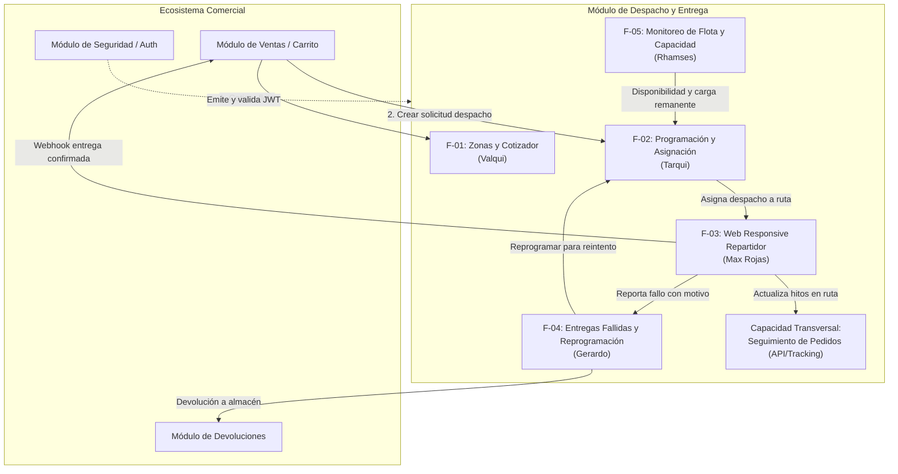
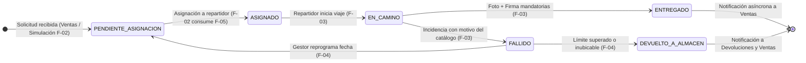

# Visión General de Arquitectura: Módulo de Despacho y Entrega a Domicilio

Este documento presenta la visión técnica y arquitectónica integral del **Módulo de Despacho y Entrega a Domicilio**: los problemas de negocio que resuelve, la interacción sistémica entre sus áreas funcionales, los actores involucrados, la máquina de estados integral, las directrices transversales de seguridad/comunicación y la especificación detallada del stack tecnológico unificado.

---

## 1. Propósito y Problema de Negocio

El módulo de Despacho tiene la misión de orquestar y controlar el ciclo de vida del transporte de paquetes desde el momento en que un pedido es confirmado en los canales comerciales (Ventas, tienda web, marketplace o chatbot) hasta que se entrega de manera efectiva en manos del cliente final o se gestiona su devolución controlada hacia el almacén.

### Problemas que Resuelve
1. **Desfase de Información en Ruta:** Permite conocer en tiempo real el estado de avance de cada paquete mediante la sincronización continua de la operación en calle y un canal de rastreo para el cliente final.
2. **Entregas sin Respaldo Probatorio:** Asegura que toda entrega concluida cuente con evidencia física incuestionable (fotografía georreferenciada y firma digitalizada del receptor) antes de ser declarada como entregada.
3. **Gestión Desestructurada de Excepciones:** Proporciona un canal estructurado con catálogo tipificado para registrar incidencias en campo, permitiendo al gestor reprogramar una nueva fecha o derivar a devolución a almacén con notificación automatizada hacia Ventas y Devoluciones.

### Principios Arquitectónicos
- **Arquitectura de Microservicios Desacoplada:** El módulo opera con su propia base de datos aislada (PostgreSQL en Supabase), sin compartir tablas ni esquemas directamente con Ventas, Inventario o Facturación.
- **Autonomía Operativa e Independencia:** Cada área funcional administra sus propios recursos y datos maestros. Se proveen mecanismos de simulación de pedidos y pruebas desacopladas para evitar bloqueos entre equipos.

---

## 2. Mapa de Funcionalidades y Responsabilidades

El módulo se compone de **5 funcionalidades especializadas** lideradas por un integrante y **1 capacidad transversal** de seguimiento compartida:



### Tabla de Distribución de Áreas

| ID | Funcionalidad | Responsable | Rol Operativo Principal |
| :---: | :--- | :--- | :--- |
| **F-01** | [Gestor de Zonas Geográficas y Cotizador](funcionalidades/F-01-Gestor_ZonasGeograficas.md) | **Valqui** | Matriz tarifaria por peso/volumen y endpoint público de cotización para carritos de venta. |
| **F-02** | [Programación y Asignación de Despachos](funcionalidades/F-02-ProgramacionAsignacionDespachos.md) | **Tarqui** | Cola de pendientes, simulación de órdenes de prueba y asignación según capacidad vehicular. |
| **F-03** | [Web Responsive del Repartidor y Evidencia](funcionalidades/F-03-AppMovilRepartidor.md) | **Max Rojas** | Interfaz web mobile-first para choferes: ruta diaria, transición de estados, fotos y firmas. |
| **F-04** | [Entregas Fallidas y Reprogramaciones](funcionalidades/F-04-GestionEntregasFallidas.md) | **Gerardo** | Resolución de incidencias en ruta, control de reintentos máximos, reprogramación y devolución. |
| **F-05** | [Monitoreo de Flota, Operadores y Capacidad](funcionalidades/F-05-MonitoreoFlotaCapacidad.md) | **Rhamses** | CRUD de choferes y flota vehicular, control de turnos y servicio de disponibilidad remanente. |
| **Transversal** | Seguimiento de Pedidos (Tracking) | Backend Despacho | Endpoint de consulta pública y timeline de hitos consumible por clientes y canales autorizados. |

---

## 3. Ciclo de Vida y Máquina de Estados del Despacho

Cada paquete gestionado por el módulo sigue una secuencia formal de transiciones gobernada por el backend:



### Reglas de Transición Inviolables
1. **Avance Estricto en Campo:** El repartidor solo puede avanzar hacia adelante: `ASIGNADO` $\rightarrow$ `EN_CAMINO` $\rightarrow$ `ENTREGADO` o `FALLIDO`.
2. **Cierre Exitoso con Evidencia:** No se permite pasar a `ENTREGADO` sin adjuntar fotografía del paquete, firma digitalizada y datos del receptor.
3. **Tipificación Obligatoria de Incidencias:** No se permite transicionar a `FALLIDO` sin seleccionar un motivo válido del catálogo oficial (`CLIENTE_AUSENTE`, `DIRECCION_NO_UBICADA`, `PAQUETE_RECHAZADO`, `ZONA_INACCESIBLE`).
4. **Política de Reintentos:** Si un despacho supera el límite de reintentos configurado (inicialmente 2), se bloquea la reprogramación y únicamente se permite la derivación a `DEVUELTO_A_ALMACEN`.

---

## 4. Acuerdos Transversales (DevOps, Seguridad y Arquitectura)

### 4.1 Seguridad y Autenticación JWT
- El módulo de Despacho no emite credenciales primarias; delega la autenticación en el **Módulo de Seguridad**.
- Todas las peticiones protegidas deben incluir el encabezado HTTP:
  ```http
  Authorization: Bearer <token_jwt>
  ```
- Cada desarrollador protege sus endpoints inyectando la configuración común de validación de firma y control de acceso basado en roles (`GESTOR_DESPACHO`, `GESTOR_FLOTA`, `REPARTIDOR`, `ADMIN`).

### 4.2 Integración Asíncrona / Webhooks Comunes
- Al completarse una entrega (`ENTREGADO`) o confirmarse una devolución definitiva (`DEVUELTO_A_ALMACEN`), el backend emite un evento asíncrono hacia los módulos interesados (Ventas/Postventa y Devoluciones).
- Para evitar duplicidad de código, se provee un servicio común en el backend (`NotificadorEventosService`) que encapsula la llamada HTTP asíncrona (código `202 Accepted`) y el esquema de reintentos con respaldo en base de datos.

### 4.3 Despliegue Continuo en la Nube
- Un integrante del equipo actúa como **líder de despliegue** para vincular el repositorio a las plataformas de nube (Render para el backend Spring Boot y Vercel para el frontend React).
- La integración sobre la rama `main` dispara construcciones y pruebas automáticas.

---

## 5. Stack Tecnológico y Herramientas del Proyecto

### 5.1 Backend
- **Lenguaje:** **Java 21 (LTS)** — Aprovecha *Virtual Threads* (Project Loom) para I/O concurrente eficiente, *Records* para DTOs inmutables y *Pattern Matching*.
- **Framework:** **Spring Boot 4.1.1** — Versión unificada para el backend del proyecto, ejecutada sobre Java 21.
- **Gestor de Dependencias:** **Maven** (`pom.xml`) unificado para todo el backend.
- **Capa Web y Servicios:** `spring-boot-starter-web` (Spring MVC para controladores RESTful).
- **Persistencia y ORM:** `spring-boot-starter-data-jpa` con Hibernate 6 para mapeo objeto-relacional y repositorios.
- **Productividad:** `org.projectlombok:lombok` (`@Getter`, `@Setter`, `@Builder`, `@RequiredArgsConstructor`) para reducir código repetitivo.
- **Driver de Base de Datos:** `org.postgresql:postgresql` (driver JDBC oficial).
- **Seguridad:** `spring-boot-starter-security` con validación sin estado de tokens Bearer JWT (`io.jsonwebtoken:jjwt`).
- **Pruebas y Calidad:** JUnit 5 (`junit-jupiter`), Mockito y AssertJ mediante `spring-boot-starter-test` para pruebas unitarias y de integración (`@WebMvcTest`, `@SpringBootTest`).

### 5.2 Frontend
- **Framework & Tooling:** **React 18/19** configurado con **Vite** para compilación ultrarrápida y Hot Module Replacement (HMR).
- **Estilos:** **Tailwind CSS** para un diseño utilitario, modular y responsivo adaptado tanto a pantallas móviles como a dashboards administrativos.
- **Suite de Dependencias Evaluadas y Justificadas:**
  - `react-router-dom`: Enrutamiento SPA entre vistas (Login, Dashboards, Hoja de Ruta, Tracking y Flota).
  - `axios`: Cliente HTTP con interceptores para inyección del header `Authorization: Bearer <JWT>` y manejo estándar de errores.
  - `@tanstack/react-query`: Manejo de estado del servidor, caché inteligente y reintentos automáticos en segundo plano para consultas de ruta y tracking.
  - `vite-plugin-pwa`: Soporte de Progressive Web App (Service Workers y manifest) para la web responsive del repartidor (F-03).
  - `react-signature-canvas`: Captura interactiva del trazo de firma digital del cliente en pantallas táctiles (F-03).
  - `browser-image-compression`: Compresión de fotografías en el cliente móvil antes del envío (< 500 KB por imagen) para optimizar datos móviles (F-03).
  - `leaflet` + `react-leaflet`: Renderizado de mapas interactivos basados en OpenStreetMap sin costo de licenciamiento para zonas (F-01), tracking público y monitoreo de flota (F-05).
  - `lucide-react`: Iconografía SVG ligera, moderna y accesible.

### 5.3 Base de Datos
- **Motor:** **PostgreSQL (v15/v16)** alojado sobre **Supabase**.
- **Infraestructura Cloud:** Conexión gestionada mediante *Connection Pooling* (Supavisor en puerto 6543 para despliegues sin saturar conexiones directas).
- **Soporte Geoespacial:** Extensión `PostGIS` activada para almacenamiento y cálculo optimizado de coordenadas geográficas (`latitud`, `longitud`) y polígonos de cobertura.

### 5.4 Mensajería Asincrónica y Eventos
- **Estrategia Desacoplada (`IEventoPublisher`):**
  - **Fase 1 (Línea Base / MVP):** Emisión mediante **Webhooks asíncronos** (`@Async` de Spring con esquema de reintentos) para notificar a Ventas (`DESPACHO_ENTREGADO`) y a Devoluciones (`DESPACHO_DEVUELTO_ALMACEN`), sin costo adicional de servidores ni brokers dedicados.
  - **Fase 2 (Escalabilidad):** El sistema queda arquitectónicamente listo para activar `spring-boot-starter-amqp` (RabbitMQ en CloudAMQP) mediante configuración sin requerir reescritura del dominio.

---

## 6. Fuera del Alcance del Módulo

- **Gestión financiera y cobros:** El cobro del pedido, facturación electrónica, notas de crédito y reembolsos corresponden al módulo de Ventas y Finanzas.
- **Ruteo dinámico con optimización GPS por IA:** El despacho planifica por zonas y asignación directa; el cálculo de trayectorias calle por calle se delega a herramientas externas de navegación (Google Maps / Waze).
- **Taller mecánico y mantenimiento vehicular:** La adquisición de vehículos, seguros y revisiones físicas se controlan en los sistemas corporativos de activos.
- **Gestión de identidad y usuarios:** El alta de cuentas y generación de credenciales reside en el módulo central de Seguridad.
