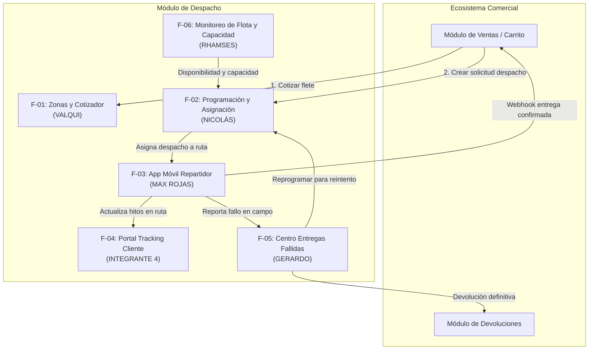
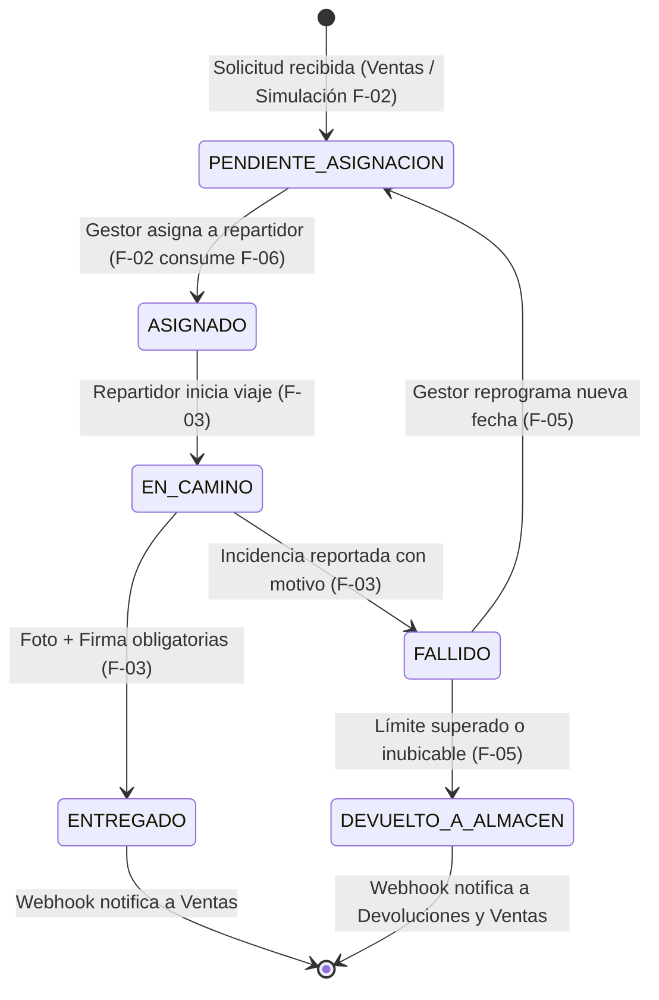

# Visión General de Arquitectura: Módulo de Despacho

Este documento presenta la visión integral del **Módulo de Despacho y Logística de Última Milla**: los problemas de negocio que resuelve, la interacción sistémica entre sus 6 componentes, los actores involucrados, la máquina de estados integral y las directrices transversales de seguridad, integración asíncrona y despliegue en nube.

---

## 1. Propósito y Problema de Negocio

El módulo de Despacho tiene la misión de orquestar y controlar el ciclo de vida del transporte de paquetes desde el momento en que un pedido es confirmado en los canales de venta hasta que se entrega de manera efectiva en manos del cliente final o se gestiona su devolución controlada.

En una arquitectura empresarial orientada a microservicios:
- **Autonomía de Datos:** El módulo opera con su propia base de datos aislada, sin compartir tablas directamente con Ventas, Inventario o Facturación.
- **Resiliencia Operativa:** Maneja picos de demanda, fallas transitorias de red en calle e independiza las pruebas y el desarrollo de cada integrante mediante mecanismos de simulación y desacoplamiento de contratos.

---

## 2. Mapa de Integrantes y Distribución de Responsabilidades

El módulo se compone de 6 capacidades especializadas, cada una liderada por un integrante con límites de dominio bien definidos:

| Integrante | Rol / Funcionalidad | Responsabilidad Principal |
| :--- | :--- | :--- |
| **Integrante 1 (Valqui)** | `F-01`: Zonas y Cotizador | Catálogo de cobertura y cálculo del costo de envío para carritos de compra. |
| **Integrante 2 (Nicolás)** | `F-02`: Programación y Asignación | Cola de pedidos pendientes, asignación según carga y pedidos de prueba para desarrollo. |
| **Integrante 3 (Max Rojas)** | `F-03`: App Móvil del Repartidor | PWA en celular para el chofer: ruta diaria, transición de estados, fotos y firmas. |
| **Integrante 4** | `F-04`: Portal Tracking Cliente | Consulta pública de rastreo con línea de tiempo cronológica y mapa referencial. |
| **Integrante 5 (Gerardo)** | `F-05`: Centro de Entregas Fallidas | Resolución de paquetes no entregados, reprogramación de fecha o devolución a almacén. |
| **Integrante 6 (Rhamses)** | `F-06`: Monitoreo de Flota y Capacidad | Gestión de choferes, turnos, límites de carga vehicular y API de disponibilidad. |

---

## 3. Ciclo de Vida y Máquina de Estados del Despacho

Cada paquete transita por un flujo formal de estados gestionado por el backend:

---

## 4. Estrategia Transversal (DevOps, Seguridad y Arquitectura)

Dado que no existe un rol exclusivo de infraestructura, las responsabilidades transversales se organizan bajo los siguientes acuerdos de equipo:

### 4.1 Seguridad y JWT
- No existe un servidor de autenticación propio dentro de Despacho; se consumen los tokens emitidos por el módulo transversal de **Seguridad**.
- **Regla:** Cada integrante asegura sus propios endpoints en el backend inyectando la misma plantilla común de configuración de seguridad (validación de firma JWT y verificación de roles: `GESTOR_DESPACHO`, `GESTOR_FLOTA`, `REPARTIDOR`, `ADMIN`).

### 4.2 Integración Asíncrona / Webhooks Comunes
- Cuando un despacho pasa a estado `ENTREGADO` (F-03) o `DEVUELTO_A_ALMACEN` (F-05), el backend dispara un evento asíncrono hacia los módulos interesados (Ventas/Postventa y Devoluciones).
- **Regla:** Para no duplicar código, el proyecto cuenta con un servicio o función común (`NotificadorEventosService`) que encapsula la emisión HTTP asíncrona (código `202 Accepted`) y el esquema de reintentos con reintentos exponenciales.

### 4.3 Despliegue Continuo en la Nube
- Se designa a 1 integrante del equipo como **líder de despliegue** encargado de la configuración inicial de los proyectos en la nube (ej. Render para el backend Java/Spring Boot y Vercel para el frontend React/PWA).
- Todo el equipo integra sus ramas sobre `main`, activando despliegues automatizados tras cada *merge* validado.

---

## 5. Stack Tecnológico y Herramientas del Proyecto

La selección de herramientas responde a criterios de rendimiento moderno, compatibilidad LTS, bajo costo de despliegue y máxima autonomía para los 6 integrantes:

### 5.1 Backend
- **Lenguaje:** **Java 21 (LTS)** — Aprovecha *Virtual Threads* (Project Loom) para I/O concurrente de alto rendimiento, *Records* para DTOs inmutables y *Pattern Matching*.
- **Framework:** **Spring Boot 3.3.x** — Versión de referencia plenamente compatible con Java 21, Spring Framework 6 y Jakarta EE 10 *(aclaración técnica: la mención preliminar a 4.1.1 corresponde a la rama actual Spring Boot 3.x)*.
- **Gestor de Dependencias:** **Maven** (`pom.xml`) como estándar unificado del repositorio backend.
- **Capa Web y Servicios:** `spring-boot-starter-web` (Spring MVC para controladores RESTful).
- **Persistencia y ORM:** `spring-boot-starter-data-jpa` con Hibernate 6 para mapeo objeto-relacional y repositorios.
- **Productividad:** `org.projectlombok:lombok` (`@Getter`, `@Setter`, `@Builder`, `@RequiredArgsConstructor`) para reducir código repetitivo.
- **Conector de Base de Datos:** `org.postgresql:postgresql` (driver JDBC oficial).
- **Seguridad:** `spring-boot-starter-security` con soporte para validación sin estado de tokens Bearer JWT (`io.jsonwebtoken:jjwt`).
- **Pruebas y Calidad:** JUnit 5 (`junit-jupiter`), Mockito y AssertJ mediante `spring-boot-starter-test` para pruebas unitarias de servicios y controladores (`@WebMvcTest`).

### 5.2 Frontend
- **Framework & Tooling:** **React 18/19** configurado con **Vite** para compilación ultrarrápida y Hot Module Replacement (HMR).
- **Estilos:** **Tailwind CSS** para un diseño utilitario, modular y responsivo adaptado tanto a pantallas móviles como a dashboards de escritorio.
- **Suite de Dependencias Evaluadas y Justificadas:**
  - `react-router-dom`: Enrutamiento y control de vistas en la Single Page Application (SPA).
  - `axios`: Cliente HTTP con interceptores para inyección del header `Authorization: Bearer <JWT>` y manejo homogéneo de errores.
  - `@tanstack/react-query`: Manejo de estado del servidor, caché inteligente y reintentos automáticos en segundo plano para consultas de ruta y tracking.
  - `vite-plugin-pwa`: Configuración de Progressive Web App (Service Workers y manifest) para permitir la instalación y operación móvil de la App del Repartidor (F-03).
  - `react-signature-canvas`: Captura interactiva del trazo de firma digital del cliente en pantallas táctiles (F-03).
  - `browser-image-compression`: Compresión de fotografías en el cliente móvil antes del envío, minimizando el consumo de datos celulares a menos de 500 KB por paquete (F-03).
  - `leaflet` + `react-leaflet`: Renderizado de mapas interactivos basados en OpenStreetMap sin costo de licenciamiento para delimitación de zonas (F-01), tracking público (F-04) y monitoreo de flota (F-06).
  - `lucide-react`: Iconografía SVG ligera, accesible y coherente en todos los paneles.

### 5.3 Base de Datos
- **Motor:** **PostgreSQL (v15/v16)** alojado sobre **Supabase**.
- **Infraestructura Cloud:** Conexión gestionada mediante *Connection Pooling* (Supavisor en puerto 6543 para despliegues sin saturar conexiones directas).
- **Soporte Geoespacial:** Extensión `PostGIS` activada para almacenamiento y cálculo optimizado de coordenadas geográficas (`latitud`, `longitud`) y polígonos de cobertura.

### 5.4 Mensajería Asincrónica y Eventos
- **Evaluación:** Se contrastó la adopción de **Webhooks HTTP** frente a un broker **RabbitMQ**:
  - *Webhooks:* No requieren costo adicional de infraestructura, ideales para el entorno universitario y despliegue directo en Render/Vercel.
  - *RabbitMQ:* Aporta desacoplamiento estricto y colas persistentes (AMQP), pero introduce dependencia de un servidor broker dedicado.
- **Estrategia Híbrida Desacoplada:** El backend define la interfaz `IEventoPublisher`.
  - **Fase 1 (Línea Base / MVP):** Emisión mediante **Webhooks asíncronos** (`@Async` de Spring con esquema de reintentos) para notificar a Ventas (`DESPACHO_ENTREGADO`) y a Devoluciones (`DESPACHO_DEVUELTO_ALMACEN`).
  - **Fase 2 (Escalabilidad):** El sistema queda desacoplado para activar `spring-boot-starter-amqp` (RabbitMQ en CloudAMQP) mediante configuración sin requerir reescritura del dominio.

---

## 6. Fuera del Alcance del Módulo

- **Gestión financiera y reembolsos:** El cobro del pedido, facturación electrónica y notas de crédito corresponden al módulo de Ventas y Finanzas.
- **Ruteo dinámico con optimización por IA:** El despacho planifica por zonas y asignación directa; el cálculo de trayectorias calle por calle se delega a herramientas externas de mapas (Google Maps / Waze).
- **Taller mecánico y mantenimiento de flota:** La adquisición de vehículos, seguros y reparaciones físicas se controlan en los sistemas corporativos de activos.